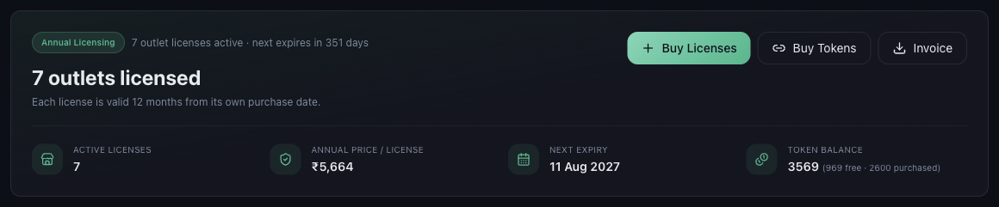
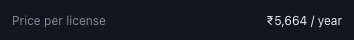

# Understanding Mynt Pricing and Annual Outlet Licences

*Billing · Read time: 4 minutes · Article only · Last updated 25 August 2026*

Mynt is priced per outlet, per year. One licence covers one outlet for twelve months. Here is exactly what that buys and what it costs.

---

## One licence, one outlet, twelve months

A licence activates a single outlet for **12 months from the day you buy it**. Each licence carries its own start and expiry date, so licences bought at different times expire at different times &mdash; they are not pooled into one annual renewal.

One licence covers that outlet on **every platform**. You do not buy a separate licence for Zomato and Swiggy: one outlet can link one account per platform under the same licence.

*Billing opens on Annual Licensing &mdash; how many licences are active, what each costs, and when the next one expires*

| | |
|---|---|
| **Active licenses** | How many outlets you are currently paying for. |
| **Annual price / license** | The per-outlet, per-year price on your account. |
| **Next expiry** | The earliest licence expiry date across all your outlets. |
| **Token balance** | Tokens left for AI Assistant queries, exports and notifications &mdash; bought separately. |

## What a licence costs

The price per licence is shown on the purchase card before you commit to anything.

*The per-licence annual price, before GST*

GST is added on top at checkout and shown as a separate line, so the total you pay is always itemised before you confirm. See [how payments and GST work](06-how-payments-gst-billing-details-work.md).

## Licences and tokens are separate

| | |
|---|---|
| **Outlet licence** | Annual. Activates one outlet so Mynt collects and reports its data. |
| **Tokens** | Pay as you go. Consumed by AI Assistant queries, exports and notifications. |

Running out of tokens does not switch off your dashboards, and buying tokens does not add an outlet. See [what Mynt tokens are](../tokens/01-what-are-mynt-tokens.md).

## Common questions

**Do all my licences renew on the same day?** — No. Each licence runs 12 months from its own purchase date. The Annual Licensing card shows the earliest upcoming expiry.

**Does one licence cover Zomato and Swiggy?** — Yes. One outlet, one licence, all platforms that outlet trades on.

**What happens if a licence expires?** — That outlet stops being collected for. Renew it and collection resumes &mdash; see the expiry guide below.

## Related guides

- [How to purchase licences](02-how-to-purchase-mynt-licences.md)
- [Licence dates, expiry and renewals](04-understanding-licence-dates-expiry-renewals.md)
- [Payments, GST and billing details](06-how-payments-gst-billing-details-work.md)

---

## Need help?

| Contact | Details |
|---------|---------|
| **Email** | contact@pyvot.in |
| **Phone** | +91 98366 66745 |
| **Phone** | +91 82407 91854 |

Or open **Help & Support** in Mynt and raise a ticket.
