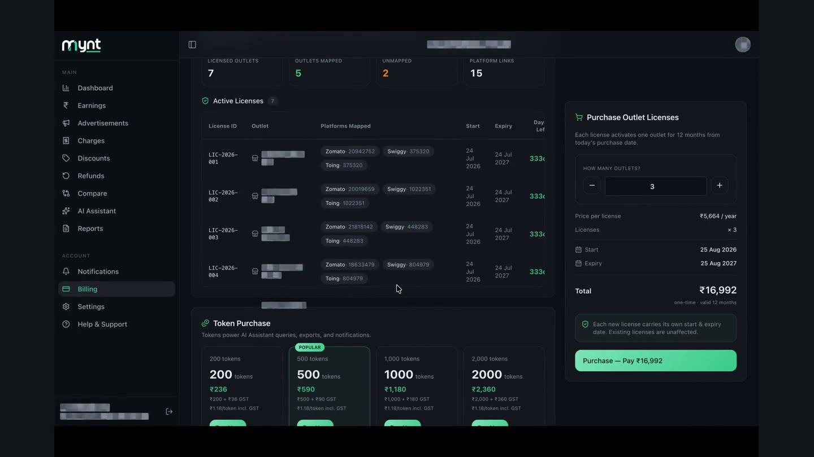
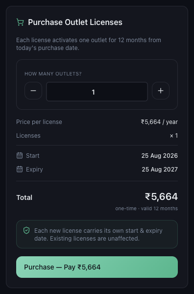
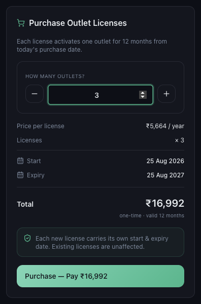

# How to Purchase Mynt Licences

*Billing · Read time: 3 minutes · Includes a short video · Last updated 25 August 2026*

Buying licences takes about a minute. Everything is priced on screen before you pay, and nothing is charged until you confirm.

---

## Watch it done

**Video:** [Setting the number of outlets and reading the total before paying](assets/how-to-purchase-mynt-licences/demo.mp4)

## Step 1 — Open Billing

Choose **Billing** in the left menu. The **Purchase Outlet Licenses** card is on the right.

*Each licence activates one outlet for 12 months from today*

## Step 2 — Choose how many outlets

Use **&minus;** and **+** under **How many outlets?**, or type the number. The card re-prices as you change it.

*Three licences &mdash; price per licence, quantity, start, expiry and total, all before paying*

| | |
|---|---|
| **Price per license** | The annual per-outlet price. |
| **Licenses** | How many you are buying, as a multiplier. |
| **Start / Expiry** | Today, and twelve months from today. |
| **Total** | One-time, valid 12 months. This is the figure the payment button repeats. |

## Step 3 — Pay

The button restates the amount &mdash; **Purchase &mdash; Pay &#8377;&hellip;** &mdash; so you confirm a number, not a promise. Mynt accepts UPI, credit card, net banking and auto debit.

> **Tip:** Buying more licences never disturbs the ones you already hold. Each new licence starts today and carries its own expiry; existing licences keep their original dates.

## Step 4 — Assign the licence to an outlet

A licence is bought first and assigned second. After payment, open **Settings → Outlet Mapping** and map the outlet&rsquo;s platform IDs so Mynt starts collecting for it. See [how to map platform outlets](../outlet-mapping/02-how-to-map-zomato-swiggy-platform-outlets.md).

## Common questions

**Can I buy for an outlet I have not added yet?** — Yes. Licences are counted, not named. Assign it when you add the outlet.

**Is the price shown with GST?** — The card shows the pre-GST total; GST is itemised at checkout.

**The payment failed &mdash; have I been charged?** — A failed payment leaves the invoice as Pending with a Retry link. See the troubleshooting guide.

## Related guides

- [Adding more licences later](03-how-to-add-more-outlet-licences.md)
- [Viewing and downloading invoices](05-how-to-view-download-invoices.md)
- [Failed payments and renewals](07-troubleshooting-failed-payments-renewals.md)

---

## Need help?

| Contact | Details |
|---------|---------|
| **Email** | contact@pyvot.in |
| **Phone** | +91 98366 66745 |
| **Phone** | +91 82407 91854 |

Or open **Help & Support** in Mynt and raise a ticket.
