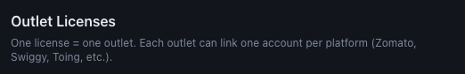
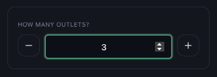

# How to Add More Outlet Licences

*Billing · Read time: 3 minutes · Article only · Last updated 25 August 2026*

Opened a new location? Add a licence for it. The process is the same as your first purchase, and your existing licences are untouched.

---

## Check what you already hold

The **Outlet Licenses** card on Billing counts your licences and how many are actually collecting data.

*One licence = one outlet. Each outlet can link one account per platform.*

| | |
|---|---|
| **Licensed outlets** | Licences you are paying for. |
| **Outlets mapped** | Of those, how many have platform IDs linked and are collecting. |
| **Unmapped** | Licensed but not collecting &mdash; you are paying and getting nothing. |
| **Platform links** | Total platform IDs linked across all outlets. |

> **Tip:** If **Unmapped** is above zero, fix that before buying more. An unmapped outlet contributes nothing to your dashboards &mdash; see [how mapping affects your data](../data-issues/05-how-incorrect-outlet-mapping-affects-data.md).

## Add the licences

1. Open **Billing**.
2. In **Purchase Outlet Licenses**, set **How many outlets?** to the number you are adding.
3. Check the total, then press **Purchase &mdash; Pay**.
4. Open **Settings → Outlet Mapping** and link the new outlet&rsquo;s platform IDs.

*Set the count &mdash; the price, start date, expiry and total all follow it*

## What happens to your existing licences

Nothing. New licences start on the day you buy them and run twelve months from that date. Licences bought at different times simply expire at different times, each shown on its own row in [the licence table](04-understanding-licence-dates-expiry-renewals.md).

## Related guides

- [How to purchase licences](02-how-to-purchase-mynt-licences.md)
- [Licence dates, expiry and renewals](04-understanding-licence-dates-expiry-renewals.md)
- [Mapping a new outlet](../outlet-mapping/02-how-to-map-zomato-swiggy-platform-outlets.md)

---

## Need help?

| Contact | Details |
|---------|---------|
| **Email** | contact@pyvot.in |
| **Phone** | +91 98366 66745 |
| **Phone** | +91 82407 91854 |

Or open **Help & Support** in Mynt and raise a ticket.
