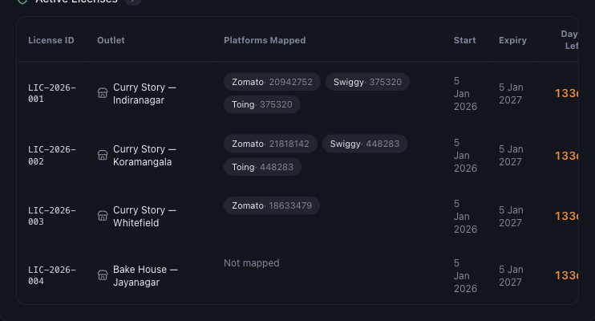

# Understanding Licence Dates, Expiry and Renewals

*Billing · Read time: 4 minutes · Article only · Last updated 25 August 2026*

Every licence carries its own dates. The licence table shows what each one covers, how long it has left, and what happens when it runs out.

---

## The licence table

Billing lists every licence with the outlet it is assigned to and the exact window it covers.

*One row per licence &mdash; each with its own start, expiry and days remaining*

| | |
|---|---|
| **License ID** | The licence&rsquo;s reference, e.g. LIC-2026-001. Quote this when contacting support. |
| **Outlet** | Which outlet the licence is assigned to. **Unassigned** means it is paid for but not yet in use. |
| **Platforms Mapped** | The platform IDs linked to that outlet. **Not mapped** means it is not collecting. |
| **Start / Expiry** | The twelve-month window this licence covers. |
| **Days Left** | Days until expiry. It turns amber, then red, as the date approaches. |

## Why your licences expire on different days

A licence runs twelve months *from its own purchase date*, not from a shared annual anniversary. Buy three outlets in January and two in June, and you have two renewal dates. The **Annual Licensing** card at the top always names the earliest one.

## What happens at expiry

- Collection stops for that outlet &mdash; new payout emails are no longer processed into it.
- Data already collected stays in your dashboards; you do not lose history.
- Renewing restarts collection. Ask support to reprocess the gap if emails arrived while it was lapsed.

> **Tip:** Watch **Days Left** rather than waiting for a reminder. The Annual Licensing card shows the next expiry across every outlet in one line.

## Renewing

Renewal is a purchase: open **Billing**, buy the number of licences you need and pay. The renewed licence starts on the day you buy it. See [how to purchase licences](02-how-to-purchase-mynt-licences.md).

## Related guides

- [Pricing and annual licences](01-understanding-mynt-pricing-annual-outlet-licences.md)
- [When a renewal payment fails](07-troubleshooting-failed-payments-renewals.md)
- [Invoices and payment history](05-how-to-view-download-invoices.md)

---

## Need help?

| Contact | Details |
|---------|---------|
| **Email** | contact@pyvot.in |
| **Phone** | +91 98366 66745 |
| **Phone** | +91 82407 91854 |

Or open **Help & Support** in Mynt and raise a ticket.
