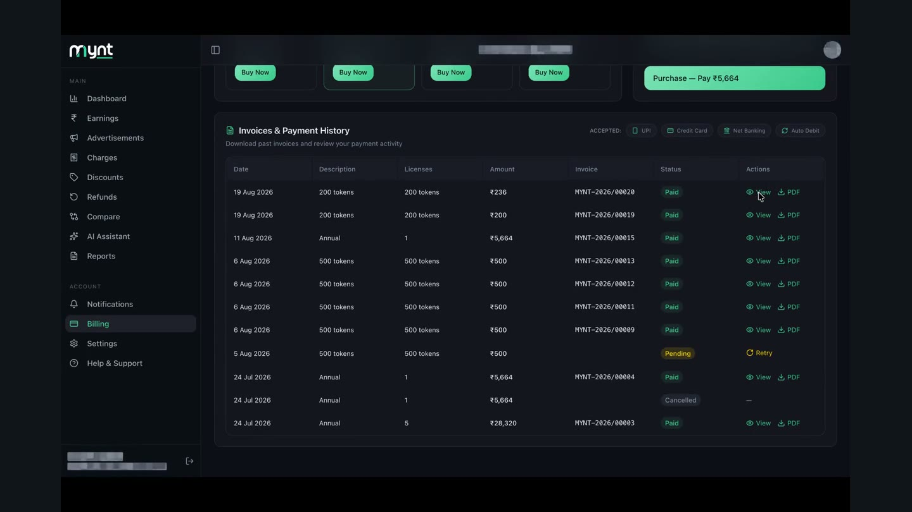
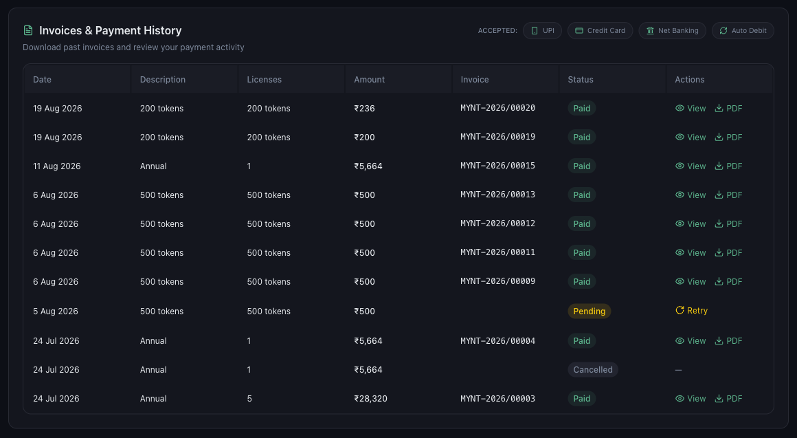
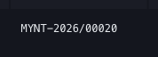

# How to View and Download Invoices

*Billing · Read time: 3 minutes · Includes a short video · Last updated 25 August 2026*

Every payment on your account has an invoice you can open on screen or download as a PDF for your accountant.

---

## Watch it done

**Video:** [Finding a payment in the history and downloading its invoice](assets/view-download-invoices/demo.mp4)

## Where invoices live

Open **Billing** and scroll to **Invoices & Payment History**. Every licence purchase and token top-up is listed, newest first.

*Licence purchases and token top-ups, newest first, each with its status and actions*

| | |
|---|---|
| **Date** | When the payment was made. |
| **Description** | What was bought &mdash; an annual licence, or a token pack. |
| **Licenses** | How many licences that payment covered. |
| **Amount** | What was charged, GST included. |
| **Invoice** | The invoice number, e.g. MYNT-2026/00020. Quote this to support or your accountant. |
| **Status** | **Paid**, **Pending**, **Failed** or **Cancelled**. |
| **Actions** | **View** opens the invoice; **PDF** downloads it. |

## Opening or downloading one

*Every paid row carries an invoice number and both actions*

1. Find the payment by date or amount.
2. Press **View** to read it on screen.
3. Press **PDF** to download it &mdash; that is the copy to send to your accountant.

> **Tip:** The invoice PDF is generated by Mynt and carries the GST details from **Settings → Account**. Get those right *before* you pay &mdash; see [payments, GST and billing details](06-how-payments-gst-billing-details-work.md).

## Rows without an invoice

A **Cancelled** row shows **&mdash;** instead of actions: no money changed hands, so there is nothing to invoice. A **Pending** row shows **Retry** instead &mdash; the payment has not completed yet. See [failed payments and renewals](07-troubleshooting-failed-payments-renewals.md).

## Related guides

- [Payments, GST and billing details](06-how-payments-gst-billing-details-work.md)
- [Failed payments and renewals](07-troubleshooting-failed-payments-renewals.md)
- [How to purchase licences](02-how-to-purchase-mynt-licences.md)

---

## Need help?

| Contact | Details |
|---------|---------|
| **Email** | contact@pyvot.in |
| **Phone** | +91 98366 66745 |
| **Phone** | +91 82407 91854 |

Or open **Help & Support** in Mynt and raise a ticket.
