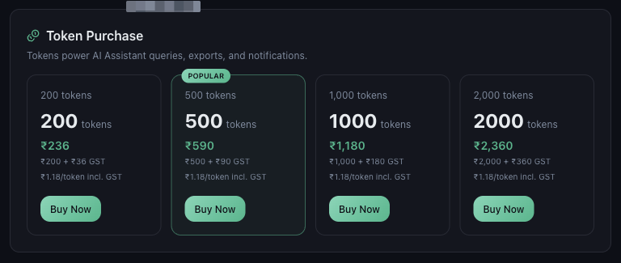
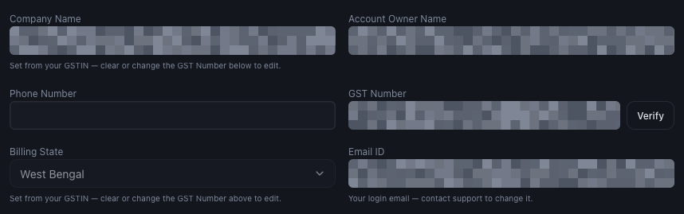

# How Payments, GST and Billing Details Work

*Billing · Read time: 4 minutes · Article only · Last updated 25 August 2026*

What Mynt accepts, how GST is applied, and which details end up printed on your invoice.

---

## What you can pay with

*Shown above the payment history, so you can check before starting a purchase*

- **UPI** &mdash; any UPI app.
- **Credit card**.
- **Net banking**.
- **Auto debit** &mdash; for recurring payments.

## How GST is applied

GST is added on top of the listed price and always itemised, never folded into a single figure. The token packs show this most clearly:

*Each pack shows the base price, the GST added, and the effective per-token cost including GST*

| | |
|---|---|
| **Listed price** | The base amount, before tax. |
| **GST** | Added on top and shown as its own line. |
| **Total** | What is actually charged &mdash; the figure the pay button repeats. |

Licence purchases work the same way: the purchase card shows the pre-GST total, and GST is itemised at checkout.

## The details printed on your invoice

Invoices are raised against what is stored in **Settings → Account**. Check these before your first purchase.

*GST number, billing state and billing address all appear on the invoice*

| | |
|---|---|
| **GST Number** | Enter it and press **Verify**. Your company name and billing state are then filled in from it automatically. |
| **Company Name** | Set from the verified GSTIN. To change it, change or clear the GST number. |
| **Billing State** | Also set from the GSTIN. It decides how GST is applied. |
| **Billing Address** | Printed on the invoice. |
| **Account Owner Name / Phone** | Contact details for the account. |
| **Email ID** | Your login address. Contact support to change it &mdash; it cannot be edited here. |

> **Tip:** Fill in the GST number *before* you buy. An invoice already raised cannot have a GSTIN added to it afterwards &mdash; that needs support.

## Common questions

**Why can I not edit my company name?** — It is taken from your verified GSTIN so the invoice matches your GST registration. Change or clear the GST number to edit it.

**Can I change my login email here?** — No. The Email ID field is read-only &mdash; contact support to change the address you sign in with.

**I paid without a GSTIN. Can it be added?** — Not to an invoice already issued. Add the GSTIN now so future invoices carry it, and contact support about the earlier one.

## Related guides

- [Viewing and downloading invoices](05-how-to-view-download-invoices.md)
- [Failed payments and renewals](07-troubleshooting-failed-payments-renewals.md)
- [How Mynt protects your business data](../security/03-how-mynt-protects-business-data.md)

---

## Need help?

| Contact | Details |
|---------|---------|
| **Email** | contact@pyvot.in |
| **Phone** | +91 98366 66745 |
| **Phone** | +91 82407 91854 |

Or open **Help & Support** in Mynt and raise a ticket.
