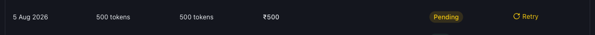
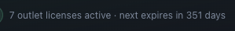

# Troubleshooting Failed Payments and Renewals

*Billing · Read time: 4 minutes · Article only · Last updated 25 August 2026*

A payment did not go through, or a renewal is due. Here is how to tell which, and what to do about it.

---

## Read the status first

Every row in **Invoices & Payment History** carries a status, and the status tells you whether money moved.

*A <strong>Pending</strong> row keeps a <strong>Retry</strong> link &mdash; the payment can be completed from here*

| | |
|---|---|
| **Paid** | Complete. The invoice is available under Actions. |
| **Pending** | Started but not completed. A **Retry** link reopens the payment. |
| **Failed** | The payment did not go through. Nothing was charged. |
| **Cancelled** | Abandoned before payment. No invoice, and **&mdash;** under Actions. |

## If a payment failed

1. Check your bank or UPI app for a debit. A **Failed** or **Cancelled** row means nothing was charged.
2. If a **Retry** link is showing, use it &mdash; it reopens the original payment rather than creating a second one.
3. If there is no Retry link, start the purchase again from **Purchase Outlet Licenses**.
4. Try a different method &mdash; UPI, credit card, net banking and auto debit are all accepted.
5. If you were charged but the row is not **Paid**, contact support with the date, amount and your bank reference. Do not pay twice.

> **Tip:** Never start a second payment for the same licence because the first looked stuck. Use **Retry**, or check with support first.

## If a renewal is due

Licences do not renew silently &mdash; each one runs twelve months from its own purchase date and then stops. Watch the countdown on the **Annual Licensing** card.

*The earliest expiry across every outlet, in one line*

To renew, buy the licences you need from **Purchase Outlet Licenses**. The new licence starts on the day you buy it.

## If an outlet stopped collecting after a renewal

1. Confirm the invoice reads **Paid**.
2. Check the licence table &mdash; the outlet should show a **Days Left** figure again.
3. Check **Platforms Mapped** on that row is not **Not mapped**.
4. Ask support to reprocess any payout emails that arrived while the licence was lapsed.

## Related guides

- [Licence dates, expiry and renewals](04-understanding-licence-dates-expiry-renewals.md)
- [Viewing and downloading invoices](05-how-to-view-download-invoices.md)
- [Payments, GST and billing details](06-how-payments-gst-billing-details-work.md)

---

## Need help?

| Contact | Details |
|---------|---------|
| **Email** | contact@pyvot.in |
| **Phone** | +91 98366 66745 |
| **Phone** | +91 82407 91854 |

Or open **Help & Support** in Mynt and raise a ticket.
