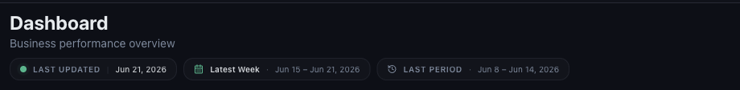
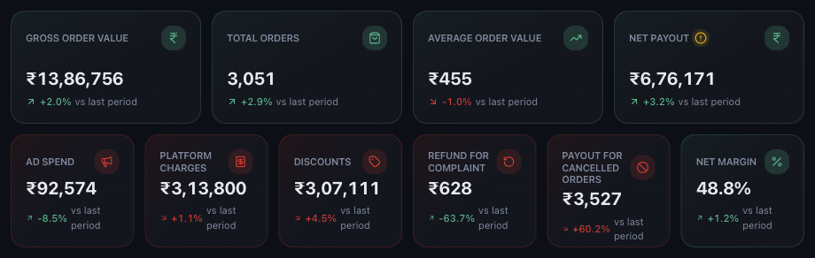

# Understanding the Mynt Dashboard

*Dashboard & Metrics · Read time: 5 minutes · Article only · Last updated 25 August 2026*

The dashboard answers one question: how did the business do over a chosen period? Everything on it is either the period you picked, a number for that period, or a comparison against the period before.

---

## Read the header first

*Three chips: how fresh the data is, what you are looking at, and what it is measured against*

| | |
|---|---|
| **LAST UPDATED** | The most recent day Mynt holds data for. If it is stale, no newer payout email has arrived. |
| **The period chip** | The range currently on screen &mdash; the label plus its exact dates. |
| **LAST PERIOD** | The range every *vs last period* figure is compared against. |

## The headline cards

Ten cards summarise the period. They fall into three groups: what customers spent, what it cost you, and what you kept.

*Sales at the top, costs in the middle, what you keep at the end*

| | |
|---|---|
| **Gross Order Value** | What customers were billed, before any platform deduction. |
| **Total Orders** | Orders in the period. |
| **Average Order Value** | Gross order value divided by orders. |
| **Net Payout** | What actually reaches your bank after everything is deducted. |
| **Ad Spend** | What you spent on platform advertising. |
| **Platform Charges** | Commission, payment gateway, delivery and other platform fees. |
| **Discounts** | The value of discounts and coupons applied. |
| **Refund for Complaint** | Refunds issued against customer complaints. |
| **Payout for Cancelled Orders** | What you were still paid on cancelled orders. |
| **Net Margin** | Net payout as a percentage of gross order value. |

> **Tip:** Every percentage on the dashboard compares against the **LAST PERIOD** chip in the header &mdash; the period immediately before the one you are viewing. It is not a year-on-year comparison.

## Below the cards

- **Platform Comparison** &mdash; the same metrics split by Zomato, Swiggy and Toing.
- **Trends** &mdash; sales, payout or orders plotted over the period.
- **AI Insights** &mdash; short prompts about what moved and what to look at.

See [reading trends, comparisons and AI insights](09-how-to-read-growth-trends-comparisons-ai-insights.md).

## Everything is filtered

Every number obeys the filter panel on the left. If a figure looks wrong, check the filters before anything else &mdash; see [using the filters](02-how-to-use-filters-date-platform-restaurant-chain-group.md).

## Related guides

- [Using the filters](02-how-to-use-filters-date-platform-restaurant-chain-group.md)
- [Gross order value explained](03-understanding-sales-gross-order-value.md)
- [When numbers look wrong](../data-issues/03-what-to-do-when-dashboard-numbers-incorrect.md)

---

## Need help?

| Contact | Details |
|---------|---------|
| **Email** | contact@pyvot.in |
| **Phone** | +91 98366 66745 |
| **Phone** | +91 82407 91854 |

Or open **Help & Support** in Mynt and raise a ticket.
