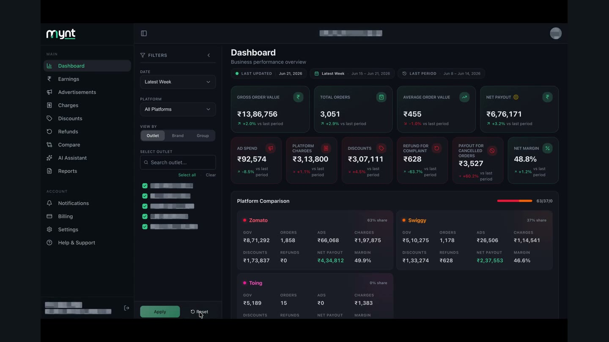
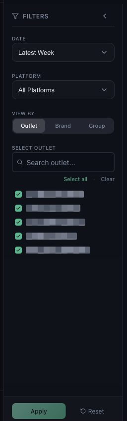

# How to Use the Filters: Date, Platform, Outlet, Brand and Group

*Dashboard & Metrics · Read time: 4 minutes · Includes a short video · Last updated 25 August 2026*

The filter panel decides what every number on the page counts. Four controls, and they apply everywhere.

---

## Watch it done

**Video:** [Changing the period, the platform and the outlet selection, and applying them](assets/how-to-use-filters-date-platform-restaurant-chain-group/demo.mp4)

## The panel

*Four controls, then <strong>Apply</strong> &mdash; nothing changes until you apply*

## DATE

| | |
|---|---|
| **Latest Week** | The most recent full week Mynt holds. |
| **Latest Month** | The most recent full month. |
| **Previous Month** | The month before that. |
| **Custom Range** | Any two dates &mdash; use this to chase a specific period. |

Whatever you pick, the header chip shows the exact dates. Read those rather than trusting the label.

## PLATFORM

Choose **All Platforms**, or narrow to **Zomato**, **Swiggy** or **Toing**. Selecting one platform is the quickest way to tell whether a problem is platform-specific &mdash; see [why one platform can be missing](../data-issues/04-why-zomato-swiggy-data-missing-incomplete.md).

## VIEW BY

| | |
|---|---|
| **Outlet** | Each licensed location on its own. |
| **Brand** | Outlets grouped by the brand they trade under. |
| **Group** | Outlets grouped by the operational groups you defined. |

This changes how rows are aggregated, not what is included. See [brands and groups](../outlet-mapping/04-how-outlet-mapping-works-multiple-outlets-chains-groups.md).

## SELECT OUTLET

Search, tick the outlets you want, or use **Select all** and **Clear**. A part-selected outlet list is the most common reason a total looks too low.

## Apply and Reset

1. Set the controls you want.
2. Press **Apply**. The page reloads its figures.
3. Press **Reset** to clear everything back to the default view.

> **Tip:** When a number looks wrong, press **Reset** first and read it again. It rules out the most likely cause in one click.

## Related guides

- [Understanding the dashboard](01-understanding-the-mynt-dashboard.md)
- [When numbers look wrong](../data-issues/03-what-to-do-when-dashboard-numbers-incorrect.md)
- [Data missing for certain dates](../data-issues/02-what-to-do-when-data-missing-certain-dates.md)

---

## Need help?

| Contact | Details |
|---------|---------|
| **Email** | contact@pyvot.in |
| **Phone** | +91 98366 66745 |
| **Phone** | +91 82407 91854 |

Or open **Help & Support** in Mynt and raise a ticket.
