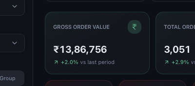
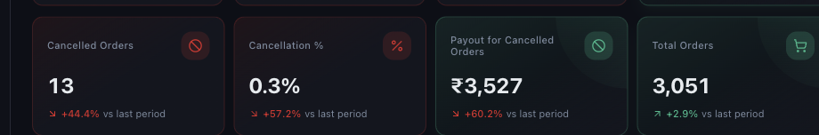

# Understanding Sales and Gross Order Value

*Dashboard & Metrics · Read time: 4 minutes · Article only · Last updated 25 August 2026*

Gross Order Value is the top line: what customers were billed, before the platforms take anything out. It is not what you get paid.

---

## What the card shows

*The total customers were billed, and how that moved against the previous period*

| | |
|---|---|
| **The figure** | Total order value for the selected period and filters, before platform deductions. |
| **The percentage** | Change against the **LAST PERIOD** range in the header. |
| **The arrow** | Green up, red down &mdash; direction only; whether that is good depends on the metric. |

## What GOV includes and excludes

| | |
|---|---|
| **Included** | Item value and charges billed to the customer on completed orders. |
| **Not deducted** | Commission, payment gateway fees, delivery charges, ad spend, discounts &mdash; those come out further down. |
| **Excluded** | Orders the platform never settled. |

Because nothing is deducted, GOV is always the largest number on the dashboard. The gap between it and **Net Payout** is the cost of trading on the platforms &mdash; see [platform charges and payouts](07-understanding-platform-charges-commissions-payouts.md).

## Cancellations and refunds

Cancelled orders are tracked separately rather than being silently netted off. The Refunds page shows how many orders were cancelled, what proportion of orders that is, and what you were still paid for them.

*Cancellations, as a count and as a share of total orders*

> **Tip:** Every percentage on the dashboard compares against the **LAST PERIOD** chip in the header &mdash; the period immediately before the one you are viewing. It is not a year-on-year comparison.

## Common questions

**Why is GOV higher than my bank credit?** — Because commission, fees, taxes and adjustments have not been taken out yet. Compare your bank against Net Payout.

**Why does GOV differ from the platform app?** — Platforms report by order date; Mynt reports what the settlement email covers. The period boundaries rarely align.

**GOV changed after I looked yesterday.** — A later settlement email can add or adjust orders in a period you have already viewed.

## Related guides

- [Orders and average order value](04-understanding-orders-and-average-order-value.md)
- [Charges, commissions and payouts](07-understanding-platform-charges-commissions-payouts.md)
- [Net margin](08-understanding-net-margin-and-profitability.md)

---

## Need help?

| Contact | Details |
|---------|---------|
| **Email** | contact@pyvot.in |
| **Phone** | +91 98366 66745 |
| **Phone** | +91 82407 91854 |

Or open **Help & Support** in Mynt and raise a ticket.
