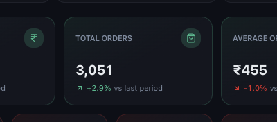
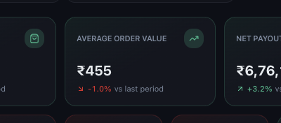

# Understanding Orders and Average Order Value

*Dashboard & Metrics · Read time: 4 minutes · Article only · Last updated 25 August 2026*

Two cards that only make sense together: how many orders came in, and how much each was worth.

---

## Total Orders

*Orders in the selected period, for the current filters*

Counts settled orders across the platforms you have selected. Cancelled orders are reported separately on the Refunds page rather than being folded in here.

## Average Order Value

*Gross order value divided by total orders*

AOV is arithmetic, not a separate measurement: **Gross Order Value &divide; Total Orders**. Narrow the filters and both halves change, so AOV can move without either underlying number looking odd.

## Reading them together

| | |
|---|---|
| **Orders up, AOV down** | More customers, smaller baskets &mdash; often the signature of a discount push. |
| **Orders down, AOV up** | Fewer but larger orders. Check whether a discount campaign ended. |
| **Both up** | Genuine growth. |
| **Both down** | Check the date range covers a full period before reading anything into it. |

> **Tip:** A partial week always drags both figures down. Confirm the period chip covers a complete week before comparing.

## Where to dig further

- Split by platform to see which one moved &mdash; see [the filters](02-how-to-use-filters-date-platform-restaurant-chain-group.md).
- Check discounts: heavy discounting lifts orders and lowers AOV &mdash; see [discounts](05-understanding-discounts-and-discount-percent.md).
- Check the hourly breakdown on the Earnings page for when orders actually arrive.

## Related guides

- [Gross order value](03-understanding-sales-gross-order-value.md)
- [Discounts and discount percent](05-understanding-discounts-and-discount-percent.md)
- [Trends and comparisons](09-how-to-read-growth-trends-comparisons-ai-insights.md)

---

## Need help?

| Contact | Details |
|---------|---------|
| **Email** | contact@pyvot.in |
| **Phone** | +91 98366 66745 |
| **Phone** | +91 82407 91854 |

Or open **Help & Support** in Mynt and raise a ticket.
