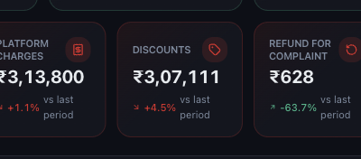
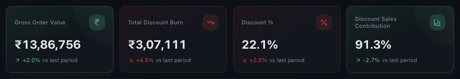

# Understanding Discounts and Discount Percent

*Dashboard & Metrics · Read time: 4 minutes · Article only · Last updated 25 August 2026*

Discounts are the easiest cost to underestimate, because they never appear as a bill. Mynt reports them as a value and as a share of sales.

---

## The headline card

*The value of discounts and coupons applied in the period*

## The Discounts dashboard

Choose **Discounts** in the left menu for the full picture &mdash; coupon performance, burn analysis and the funding split.

*Discount burn against gross order value, and what that is as a percentage*

| | |
|---|---|
| **Total Discount Burn** | The rupee value of discounts applied. |
| **Discount %** | Discount burn as a share of gross order value &mdash; the number to watch. |
| **Discount Sales Contribution** | How much of your sales came from discounted orders. |
| **Discounted Orders** | How many orders carried a discount. |
| **Avg Discount / Order** | Average discount on the orders that had one. |
| **Discount Trend** | Burn over time, daily, weekly or monthly. |

## Why Discount % matters more than the rupee figure

Discount value rises naturally as sales rise. The percentage tells you whether you are buying growth or simply growing. A rising Discount % with flat orders means you are paying more for the same volume.

> **Tip:** Every percentage on the dashboard compares against the **LAST PERIOD** chip in the header &mdash; the period immediately before the one you are viewing. It is not a year-on-year comparison.

## Reading it against the other cards

| | |
|---|---|
| **Discounts up, orders up, AOV down** | The discount is working, at a cost. Compare against net margin. |
| **Discounts up, orders flat** | You are discounting without buying volume. |
| **Discounts up, net margin down** | The discount is coming straight out of profit. |

## Related guides

- [Orders and average order value](04-understanding-orders-and-average-order-value.md)
- [Net margin and profitability](08-understanding-net-margin-and-profitability.md)
- [Advertising spend](06-understanding-advertising-spend-and-ad-performance.md)

---

## Need help?

| Contact | Details |
|---------|---------|
| **Email** | contact@pyvot.in |
| **Phone** | +91 98366 66745 |
| **Phone** | +91 82407 91854 |

Or open **Help & Support** in Mynt and raise a ticket.
