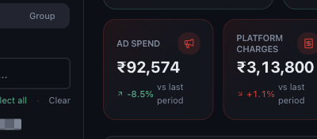
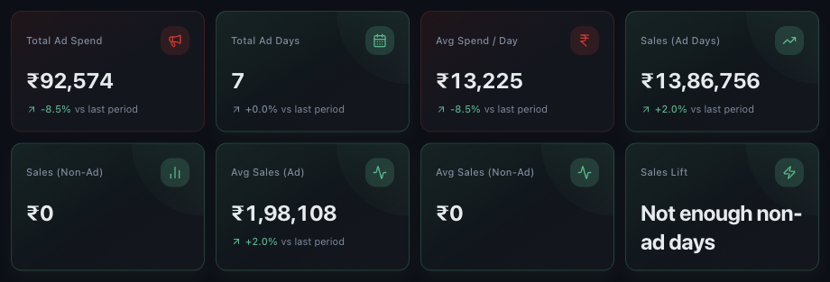

# Understanding Advertising Spend and Ad Performance

*Dashboard & Metrics · Read time: 4 minutes · Article only · Last updated 25 August 2026*

What you spent on platform advertising, and what it bought. Unlike discounts, this one does arrive as a bill &mdash; which makes it easier to judge.

---

## The headline card

*Total platform advertising spend for the period*

## The Advertisements page

Choose **Advertisements** in the left menu for ad spend analysis and its sales impact.

*Spend, how many days you advertised, and what that averages per day*

| | |
|---|---|
| **Total Ad Spend** | What you spent on platform advertising in the period. |
| **Total Ad Days** | How many days of the period had advertising running. |
| **Avg Spend / Day** | Total spend divided by ad days &mdash; comparable across periods of different lengths. |
| **Sales (Ad Days)** | Sales on the days advertising ran, so spend and result sit side by side. |

## Judging whether it is working

1. Compare **Avg Spend / Day** across periods rather than total spend &mdash; a longer period spends more by definition.
2. Look at orders over the same period: did volume move with the spend?
3. Check **Net Margin**: advertising that lifts sales but sinks margin is not paying for itself.
4. Split by platform &mdash; the two rarely perform alike.

> **Tip:** Read ad spend and discounts together. Both buy volume, both come out of margin, and heavy use of one often hides the effect of the other.

## Related guides

- [Discounts and discount percent](05-understanding-discounts-and-discount-percent.md)
- [Net margin and profitability](08-understanding-net-margin-and-profitability.md)
- [Trends and comparisons](09-how-to-read-growth-trends-comparisons-ai-insights.md)

---

## Need help?

| Contact | Details |
|---------|---------|
| **Email** | contact@pyvot.in |
| **Phone** | +91 98366 66745 |
| **Phone** | +91 82407 91854 |

Or open **Help & Support** in Mynt and raise a ticket.
