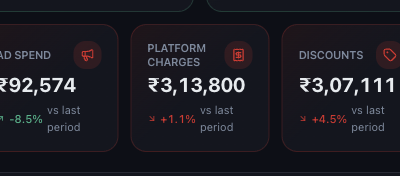
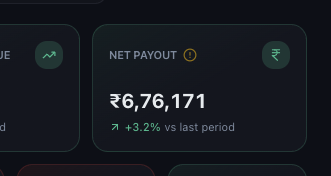
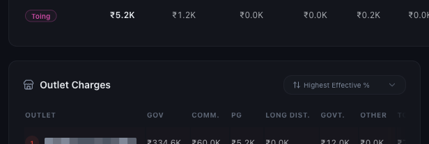

# Understanding Platform Charges, Commissions and Payouts

*Dashboard & Metrics · Read time: 5 minutes · Article only · Last updated 25 August 2026*

The gap between what customers paid and what reaches your bank. This is where it goes.

---

## Platform Charges

*Everything the platforms deducted in the period*

## Net Payout

*What actually reaches you &mdash; this is the figure to compare against your bank*

If you are reconciling against a bank statement, **Net Payout** is the number to use, not Gross Order Value.

## What makes up the charges

Choose **Charges** in the left menu for the breakdown, outlet by outlet.

*Per outlet: gross order value, then each charge type, and the effective percentage*

| | |
|---|---|
| **Commission** | The platform&rsquo;s cut of each order &mdash; usually the largest single line. |
| **PG** | Payment gateway charges for collecting the money. |
| **Long distance** | Delivery surcharges on orders beyond the standard radius. |
| **Government** | Taxes and statutory deductions. |
| **Other** | Packaging and remaining platform fees. |

The table can be sorted by highest effective percentage, which surfaces the outlets giving away the most per rupee of sales.

## Why two outlets pay different rates

- Commission rates are negotiated per outlet and per platform.
- Delivery surcharges depend on location and order distance.
- Order mix matters &mdash; more small orders means gateway fees weigh more heavily.

## Reconciling against your bank

1. Set the date range to the payout cycle, not the calendar month.
2. Compare against **Net Payout**.
3. Allow for cancellations and refunds settled in that cycle.
4. Still off? See [when dashboard numbers look wrong](../data-issues/03-what-to-do-when-dashboard-numbers-incorrect.md).

## Related guides

- [Gross order value](03-understanding-sales-gross-order-value.md)
- [Net margin and profitability](08-understanding-net-margin-and-profitability.md)
- [When numbers look wrong](../data-issues/03-what-to-do-when-dashboard-numbers-incorrect.md)

---

## Need help?

| Contact | Details |
|---------|---------|
| **Email** | contact@pyvot.in |
| **Phone** | +91 98366 66745 |
| **Phone** | +91 82407 91854 |

Or open **Help & Support** in Mynt and raise a ticket.
