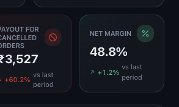
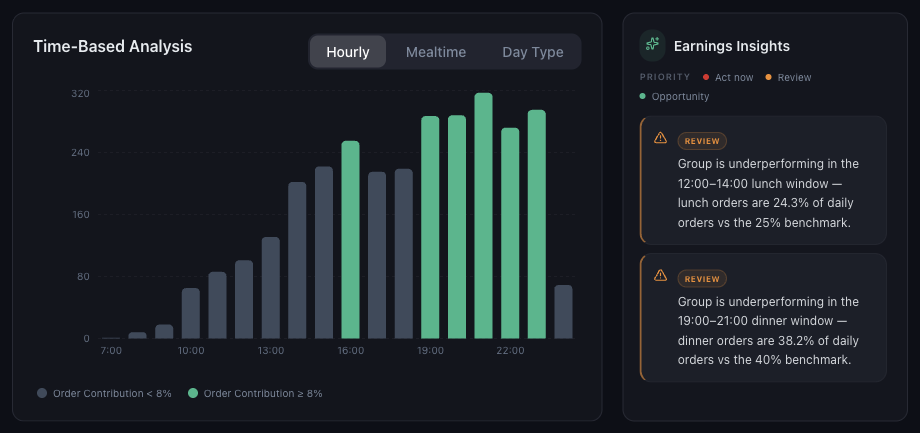

# Understanding Net Margin and Profitability

*Dashboard & Metrics · Read time: 4 minutes · Article only · Last updated 25 August 2026*

Net Margin is the one number that ties the rest together: what share of what customers paid you actually keep.

---

## The card

*Net payout as a percentage of gross order value*

The arithmetic is **Net Payout &divide; Gross Order Value**. Everything that reduces net payout &mdash; commission, gateway fees, delivery charges, discounts, ad spend, taxes &mdash; shows up here as a lower percentage.

## What moves it

| | |
|---|---|
| **Discounts** | Reduce what you are paid without reducing gross order value. Margin falls. |
| **Ad spend** | Same effect &mdash; paid out of your share. |
| **Commission rates** | Fixed per outlet and platform; a shift in mix towards a higher-commission platform lowers margin. |
| **Order mix** | Many small orders means gateway and packaging fees weigh more. |
| **Cancellations** | Charges can still apply, so they cost margin. |

## Digging into when the money is made

The **Earnings** page breaks performance down by time &mdash; hourly, by mealtime and by day type &mdash; and adds insights that compare each window against a benchmark.

*Which hours actually earn, and where the account is under-performing its benchmark*

## Comparing margin fairly

1. Compare like periods &mdash; a partial week distorts everything.
2. Compare per platform: the same business often runs several points apart on Zomato and Swiggy.
3. Compare per outlet with **VIEW BY → Outlet**. One bad location can drag the group figure down.
4. Check discounts and ad spend before concluding that commission is the problem.

> **Tip:** Every percentage on the dashboard compares against the **LAST PERIOD** chip in the header &mdash; the period immediately before the one you are viewing. It is not a year-on-year comparison.

## Related guides

- [Charges, commissions and payouts](07-understanding-platform-charges-commissions-payouts.md)
- [Discounts and discount percent](05-understanding-discounts-and-discount-percent.md)
- [Trends, comparisons and AI insights](09-how-to-read-growth-trends-comparisons-ai-insights.md)

---

## Need help?

| Contact | Details |
|---------|---------|
| **Email** | contact@pyvot.in |
| **Phone** | +91 98366 66745 |
| **Phone** | +91 82407 91854 |

Or open **Help & Support** in Mynt and raise a ticket.
