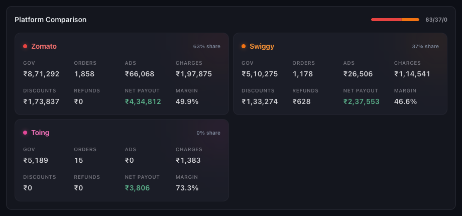
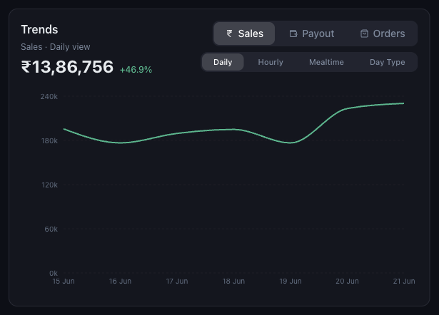
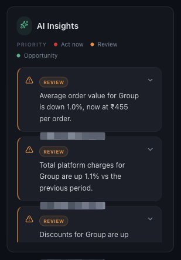

# How to Read Growth Trends, Comparisons and AI Insights

*Dashboard & Metrics · Read time: 5 minutes · Article only · Last updated 25 August 2026*

Below the headline cards sit the three tools for working out <em>why</em> a number moved: the platform split, the trend line, and the insights panel.

---

## Platform Comparison

*The same metrics per platform, with each platform&rsquo;s share of gross order value*

Each platform card repeats the headline metrics &mdash; gross order value, orders, ads, charges, discounts, refunds, net payout and margin &mdash; so you can see which platform moved the group figure. A share bar at the top shows the split at a glance.

> **Tip:** Margin often differs by several points between platforms on the same menu. If group margin fell, check whether the mix shifted rather than assuming rates changed.

## Trends

*Sales, payout or orders &mdash; daily, hourly, by mealtime or by day type*

| | |
|---|---|
| **Sales / Payout / Orders** | Which measure to plot. |
| **Daily** | Day by day across the period &mdash; best for spotting a single bad day. |
| **Hourly** | By hour of day &mdash; best for staffing and kitchen capacity. |
| **Mealtime** | Grouped into meal windows. |
| **Day Type** | Weekday against weekend. |

A card tells you *that* something moved; the trend tells you *when*. A week that is down because of one closed day reads very differently from one that is down every day.

## AI Insights

*Each insight is tagged by priority &mdash; act now, review, or opportunity*

| | |
|---|---|
| **Act now** | Something is costing money today. |
| **Review** | Worth a look, not urgent. |
| **Opportunity** | A positive movement worth building on. |

Insights are generated from the same filtered data as the cards, so changing the filters changes the insights. They point at where to look; the trend and comparison views tell you what actually happened.

## A workable order to read them in

1. Read the headline card that moved.
2. Check **Platform Comparison** &mdash; is it one platform or both?
3. Check **Trends** &mdash; is it one day or the whole period?
4. Read **AI Insights** for what the data itself flags.
5. Narrow with **VIEW BY → Outlet** to find the specific location.

## Related guides

- [Understanding the dashboard](01-understanding-the-mynt-dashboard.md)
- [Using the filters](02-how-to-use-filters-date-platform-restaurant-chain-group.md)
- [Net margin and profitability](08-understanding-net-margin-and-profitability.md)

---

## Need help?

| Contact | Details |
|---------|---------|
| **Email** | contact@pyvot.in |
| **Phone** | +91 98366 66745 |
| **Phone** | +91 82407 91854 |

Or open **Help & Support** in Mynt and raise a ticket.
