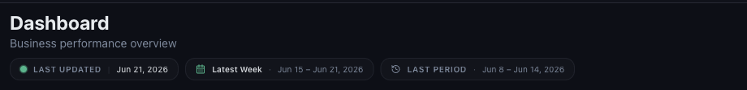
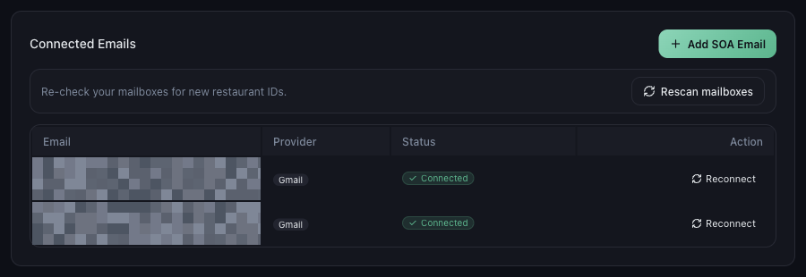
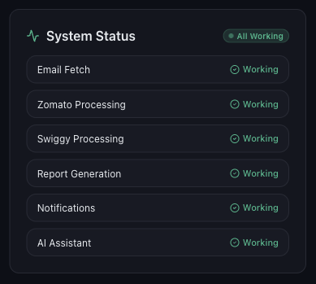

# Why Today's or Recent Data Is Not Showing Yet

*Data Issues · Read time: 4 minutes · Article only · Last updated 25 August 2026*

You opened Mynt expecting yesterday&rsquo;s sales and the dashboard looks a few days behind. Most of the time this is normal. Here is why it happens and what to check.

---

## The short answer

Mynt reads your numbers from the **payout and settlement emails** Zomato and Swiggy send to your connected inbox. Those emails do not arrive the moment an order is placed &mdash; platforms send them on their own payout cycle, often weekly. Mynt can only show a day once the email covering it has arrived.

So Mynt is not a live order tracker. It is an accurate picture of what the platforms have actually settled.

## Check the dates you are actually looking at

Every dashboard page carries three chips under the title. Read them before assuming data is missing.

*LAST UPDATED is the newest day Mynt holds. The next two chips are the period you are viewing and the one it is compared against.*

| | |
|---|---|
| **LAST UPDATED** | The most recent day Mynt has data for. If this is three days old, no newer payout email has arrived. |
| **Latest Week / Latest Month** | The period currently on screen, with its exact dates. |
| **LAST PERIOD** | The earlier period every *vs last period* figure is measured against. |

## Confirm your inbox is still connected

Go to **Settings → Email Integration**. Every mailbox should show a green **Connected** badge. If one shows anything else, Mynt has stopped reading it and no new data can arrive from it.

*Settings &rarr; Email Integration &mdash; each mailbox should read Connected*

> **Tip:** The **Rescan mailboxes** button re-checks your connected inboxes for new restaurant IDs. Use it after adding an outlet on Zomato or Swiggy.

## Check Mynt itself is healthy

Open **Help & Support** and look at the **System Status** card. **Email Fetch** and the platform processing rows should all read **Working**.

*All Working means the pipeline is running normally*

## Common reasons recent data is missing

| | |
|---|---|
| **The platform has not sent the email yet** | Zomato and Swiggy send settlement mail on a payout cycle, often weekly. Today&rsquo;s orders may not appear until the next cycle. |
| **Mynt is still reading a new email** | Give it a few minutes after a payout email lands, and a little longer right after you first connect a mailbox. |
| **The date range excludes those days** | Widen it to **Latest Week** or **Latest Month**. |
| **A filter is hiding the outlet** | Check the platform and outlet filters in the left panel. |
| **The outlet is not mapped** | An unmapped restaurant ID is skipped entirely. See the outlet mapping guide below. |

## What to do, in order

1. Widen the **DATE** filter and confirm the period includes the days you expect.
2. Check **LAST UPDATED** &mdash; that is the newest day Mynt actually holds.
3. Confirm **Settings → Email Integration** shows **Connected**.
4. Check **Help & Support → System Status** reads **All Working**.
5. Confirm the outlet is mapped in **Settings → Outlet Mapping**.
6. Still missing after 24 hours? [Raise a ticket](06-how-to-raise-data-issue-support-ticket.md).

## Common questions

**Should I see today&rsquo;s live orders?** — No. Mynt reports on payout and settlement emails, not live order feeds. There is no real-time order count.

**I connected my inbox yesterday &mdash; why is last month empty?** — How far back Mynt can fill depends on your plan and on how far back payout emails still exist in that mailbox.

**One outlet updated, another did not.** — Check that outlet&rsquo;s mapping first &mdash; that is the usual cause.

## Related guides

- [Data missing for certain dates](02-what-to-do-when-data-missing-certain-dates.md)
- [How outlet mapping affects your data](05-how-incorrect-outlet-mapping-affects-data.md)
- [Gmail connected but data missing](../email-integration/07-gmail-connected-but-data-missing-troubleshooting.md)

---

## Need help?

| Contact | Details |
|---------|---------|
| **Email** | contact@pyvot.in |
| **Phone** | +91 98366 66745 |
| **Phone** | +91 82407 91854 |

Or open **Help & Support** in Mynt and raise a ticket.
