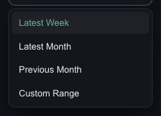
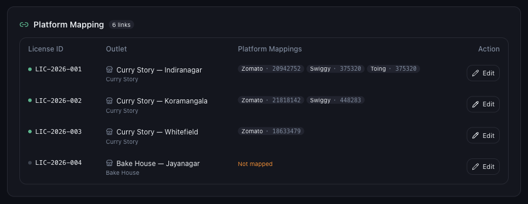

# What to Do When Data Is Missing for Certain Dates

*Data Issues · Read time: 5 minutes · Article only · Last updated 25 August 2026*

Most weeks look right, but one specific stretch is blank. Four things cause that, in the order worth checking them.

---

## Step 1 — Rule out the filters first

A wrong filter looks exactly like missing data. Open the filter panel on the left and set **DATE** to a range that definitely covers the gap.

*Use Custom Range to target the exact dates you think are missing*

| | |
|---|---|
| **Latest Week** | The most recent full week Mynt holds. |
| **Latest Month** | The most recent full month. |
| **Previous Month** | The month before that. |
| **Custom Range** | Any two dates you choose &mdash; the one to use when chasing a specific gap. |

While you are there, set **PLATFORM** to **All Platforms** and **SELECT OUTLET** to **Select all**. Narrow filters are the single most common cause of a &ldquo;missing&rdquo; week.

## Step 2 — Check the payout email exists

Mynt can only show what arrived by email. Open the mailbox connected in **Settings → Email Integration** and search for the Zomato or Swiggy settlement email covering those dates.

- If the email **is not there**, Mynt cannot show that period. Ask the platform to resend it, or check whether it went to a different mailbox.
- If it went to a mailbox Mynt does not read, add that mailbox with **Add SOA Email**.

> **Tip:** Platforms usually send one settlement email per payout cycle. A single &ldquo;missing day&rdquo; inside a week is often just rolled into that week&rsquo;s total rather than genuinely absent.

## Step 3 — Check the outlet was mapped at the time

If a restaurant ID was not mapped when Mynt processed that week&rsquo;s email, that outlet&rsquo;s numbers for that week are missing or under-reported. Go to **Settings → Outlet Mapping** and check the **Platform Mapping** table.

*Every outlet should show at least one platform ID. Orange <strong>Not mapped</strong> means it is being skipped.*

## Step 4 — Check whether it is one platform or both

Set **PLATFORM** to **Zomato** alone, then **Swiggy** alone. If only one is blank, the problem is that platform&rsquo;s ID or its emails, not Mynt as a whole. See [why one platform can be missing](04-why-zomato-swiggy-data-missing-incomplete.md).

## Step 5 — Raise a ticket with the right details

If the emails exist, the mapping is right and the filters are wide, support needs these five things:

1. The outlet name (or licence ID) affected.
2. The **exact date range** &mdash; for example 14 Jul &ndash; 20 Jul 2026.
3. Which platform: Zomato, Swiggy, or both.
4. Which mailbox the payout email arrived in.
5. Whether other outlets show data for the same period.

See [how to raise a data issue ticket](06-how-to-raise-data-issue-support-ticket.md).

## Related guides

- [Why recent data is not showing yet](01-why-todays-recent-data-not-showing.md)
- [When dashboard numbers look wrong](03-what-to-do-when-dashboard-numbers-incorrect.md)
- [Why one platform can be missing](04-why-zomato-swiggy-data-missing-incomplete.md)

---

## Need help?

| Contact | Details |
|---------|---------|
| **Email** | contact@pyvot.in |
| **Phone** | +91 98366 66745 |
| **Phone** | +91 82407 91854 |

Or open **Help & Support** in Mynt and raise a ticket.
