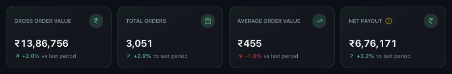
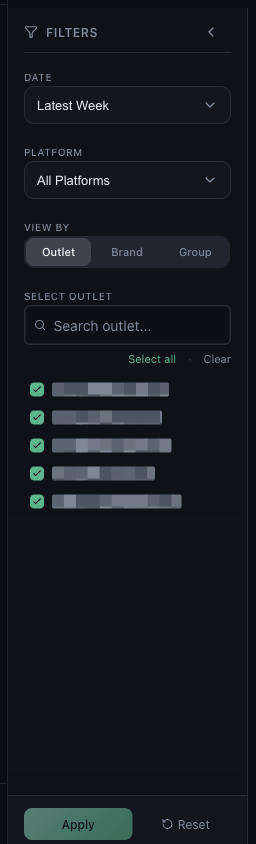

# What to Do When Dashboard Numbers Look Incorrect

*Data Issues · Read time: 5 minutes · Article only · Last updated 25 August 2026*

A figure looks too high, too low, or does not match what the platform app says. Nine times out of ten the number is right and the two of you are counting different things.

---

## First, read the card properly

Each headline card shows a value and a change against the comparison period &mdash; not against the same period last year.

*Every card compares against the LAST PERIOD chip in the header, not against last year*

| | |
|---|---|
| **Gross Order Value** | What customers were billed, before platform deductions. |
| **Total Orders** | Number of orders in the period. |
| **Average Order Value** | Gross order value divided by orders. |
| **Net Payout** | What actually reaches you after commission, fees and adjustments. |

**Gross Order Value and Net Payout are meant to differ**, often by a wide margin. If you are comparing Mynt against your bank statement, compare it against **Net Payout**.

## Then check the filters

The left panel decides what is counted. A number that looks wrong is very often a number for a narrower slice than you meant.

*DATE, PLATFORM, VIEW BY and the outlet list all narrow what the cards count*

1. **DATE** &mdash; is the period the one you meant? Check the dates on the chip, not just the label.
2. **PLATFORM** &mdash; **All Platforms**, or is one selected?
3. **VIEW BY** &mdash; **Outlet**, **Brand** or **Group** changes how rows are aggregated.
4. **SELECT OUTLET** &mdash; use **Select all** to be certain nothing is excluded.
5. Press **Reset** to clear everything and read the number again.

## Why Mynt and the platform dashboard disagree

| | |
|---|---|
| **Different date basis** | Platforms report by order date; settlement emails report by payout cycle. Week boundaries rarely line up. |
| **Refunds and cancellations** | These are netted out in the settlement, so Mynt shows the settled figure. |
| **Taxes and TDS** | Deducted before payout, so they lower Net Payout but not Gross Order Value. |
| **One outlet unmapped** | Its orders are skipped entirely, which shows as a low total. |
| **Partially processed week** | A payout email that has not arrived yet leaves the period incomplete. |

## If the number is still wrong

Confirm every outlet is mapped &mdash; see [how mapping affects your data](05-how-incorrect-outlet-mapping-affects-data.md) &mdash; and then [raise a ticket](06-how-to-raise-data-issue-support-ticket.md) with the metric, the exact period, the figure Mynt shows and the figure you expected.

## Common questions

**Why is Net Payout so much lower than Gross Order Value?** — Commission, payment gateway charges, packaging fees, promotional funding and taxes all come out in between. That gap is normal.

**The number changed since yesterday.** — It can. A later settlement email can add orders, refunds or adjustments to a period you already looked at.

**Average Order Value looks wrong.** — It is gross order value divided by orders for the current filters. Narrow the filters and both halves change.

## Related guides

- [Data missing for certain dates](02-what-to-do-when-data-missing-certain-dates.md)
- [How outlet mapping affects your data](05-how-incorrect-outlet-mapping-affects-data.md)
- [Understanding gross order value](../dashboard-metrics/03-understanding-sales-gross-order-value.md)

---

## Need help?

| Contact | Details |
|---------|---------|
| **Email** | contact@pyvot.in |
| **Phone** | +91 98366 66745 |
| **Phone** | +91 82407 91854 |

Or open **Help & Support** in Mynt and raise a ticket.
