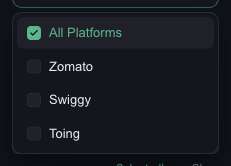
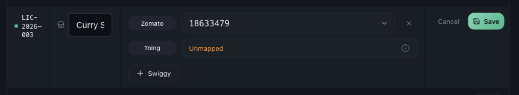

# Why Zomato or Swiggy Data Is Missing or Incomplete

*Data Issues · Read time: 4 minutes · Article only · Last updated 25 August 2026*

Zomato is there and Swiggy is blank, or the other way round. When only one platform is affected, the cause is nearly always that platform&rsquo;s ID or that platform&rsquo;s emails.

---

## Confirm it really is one platform

Open the filter panel and set **PLATFORM** to one platform at a time. Mynt supports **Zomato**, **Swiggy** and **Toing**.

*Select one platform at a time to see which is actually empty*

> **Tip:** Toing mirrors your Swiggy restaurant ID and is filled in automatically. There is nothing to map for it by hand.

## Cause 1 — that platform&rsquo;s ID is not linked

An outlet can be linked on Zomato and not on Swiggy. Mynt keeps a separate restaurant ID per platform, and it only counts orders for IDs it holds.

Go to **Settings → Outlet Mapping → Platform Mapping** and press **Edit** on the outlet.

*This outlet has a Zomato ID but no Swiggy ID &mdash; every Swiggy order for it is skipped*

1. Press **Edit** on the outlet&rsquo;s row.
2. Press **+ Swiggy** (or **+ Zomato**) to add the missing platform.
3. Pick the restaurant ID from the list. Mynt only lists IDs it has actually seen in your payout mail.
4. Press **Save**.

## Cause 2 — the ID is not in the list yet

If the dropdown is empty or the ID you want is not offered, Mynt has not seen that ID in your connected mailboxes yet. That usually means one of:

- No payout email from that platform has arrived yet for that outlet.
- That platform sends to a mailbox Mynt does not read &mdash; add it with **Add SOA Email**.
- The outlet is brand new on that platform. Press **Rescan mailboxes** once mail has arrived.

## Cause 3 — that platform&rsquo;s processing is degraded

Open **Help & Support** and check **System Status**. **Zomato Processing** and **Swiggy Processing** are listed separately, so one can be degraded while the other is fine.

## Cause 4 — the period predates the link

Linking an ID today does not retroactively rebuild every past week on its own. If a platform was linked late, ask support to reprocess the earlier period.

## Related guides

- [How outlet mapping affects your data](05-how-incorrect-outlet-mapping-affects-data.md)
- [How to map Zomato and Swiggy outlets](../outlet-mapping/02-how-to-map-zomato-swiggy-platform-outlets.md)
- [Raise a data issue ticket](06-how-to-raise-data-issue-support-ticket.md)

---

## Need help?

| Contact | Details |
|---------|---------|
| **Email** | contact@pyvot.in |
| **Phone** | +91 98366 66745 |
| **Phone** | +91 82407 91854 |

Or open **Help & Support** in Mynt and raise a ticket.
