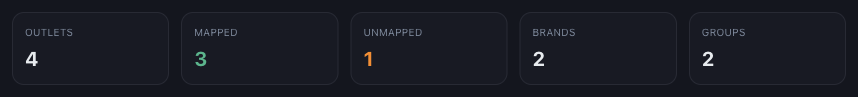
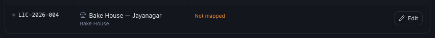
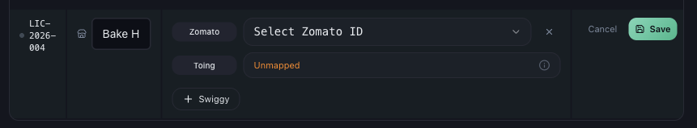
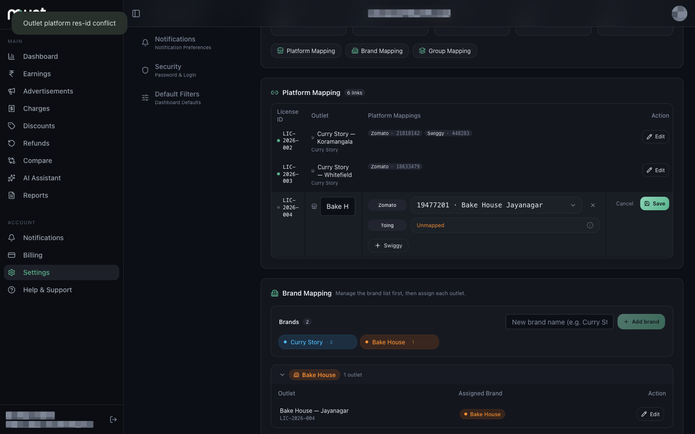

# How Incorrect Outlet Mapping Affects Your Data

*Data Issues · Read time: 5 minutes · Article only · Last updated 25 August 2026*

Outlet mapping decides which orders belong to which shop. Get it wrong and the numbers are not slightly off &mdash; they are attributed to the wrong outlet, or dropped entirely.

---

## What mapping actually controls

Zomato and Swiggy identify each shop by a **restaurant ID**. Mynt matches those IDs to your outlets. Every order in a payout email is filed under the outlet holding that ID &mdash; and an ID Mynt does not hold is skipped, not queued.

## Start with the counters

The top of **Settings → Outlet Mapping** tells you the state of every outlet at a glance.

*<strong>UNMAPPED</strong> above zero means orders are being dropped right now*

## Symptom 1 — an outlet is unmapped

An unmapped outlet shows **Not mapped** in orange and contributes nothing to any total.

*This outlet contributes nothing to any dashboard figure*

Press **Edit** on the row, add the platform, pick the restaurant ID and press **Save**.

*Mynt only offers IDs it has actually seen in your payout mail*

## Symptom 2 — one outlet shows another shop&rsquo;s sales

The ID is on the wrong outlet. A restaurant ID can belong to only one outlet in your account, so it has to be removed before it can be re-added:

1. Open the outlet that *wrongly* holds the ID and press **Edit**.
2. Press **&times;** beside that platform to remove the ID, then **Save**.
3. Open the correct outlet, press **Edit**, add the platform, pick the ID and **Save**.

Past periods stay attributed to the old outlet until support reprocesses them. Fixing the mapping corrects what comes next, not what is already filed.

## Symptom 3 — "Outlet platform res-id conflict"

You press **Save** and this appears at the top of the screen:

*Mynt rejects the save and shows <strong>Outlet platform res-id conflict</strong>*

It means that restaurant ID is already registered to a *different Mynt account* &mdash; not just a different outlet of yours. It happens after an ownership change, or when the outlet was first set up under another login.

You cannot move it yourself. [Raise a ticket](06-how-to-raise-data-issue-support-ticket.md) with the platform, the restaurant ID and which outlet it should belong to.

## Symptom 4 — totals lower than they should be

1. Is **UNMAPPED** above zero?
2. Does every outlet show an ID for *every* platform it trades on?
3. Is **Settings → Email Integration** showing **Connected**?
4. Is the dashboard date range one where those outlets actually traded?

## Quick reference

| | |
|---|---|
| **Orange **Not mapped**** | Edit the row, add the platform, pick the ID, Save. |
| **Wrong outlet&rsquo;s sales showing** | Remove the ID from the wrong outlet first, then add it to the right one. |
| ****Outlet platform res-id conflict**** | The ID belongs to another account &mdash; only support can move it. |
| **ID missing from the dropdown** | Mynt has not seen it in your mail yet. Check the mailbox, then Rescan mailboxes. |
| **Past periods still wrong after a fix** | Ask support to reprocess that date range. |

## Related guides

- [Why one platform can be missing](04-why-zomato-swiggy-data-missing-incomplete.md)
- [Fixing incorrect or duplicate outlets](../outlet-mapping/05-how-to-fix-incorrect-duplicate-unmapped-outlets.md)
- [Raise a data issue ticket](06-how-to-raise-data-issue-support-ticket.md)

---

## Need help?

| Contact | Details |
|---------|---------|
| **Email** | contact@pyvot.in |
| **Phone** | +91 98366 66745 |
| **Phone** | +91 82407 91854 |

Or open **Help & Support** in Mynt and raise a ticket.
