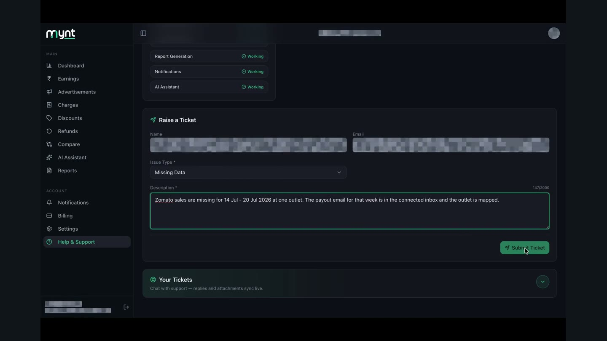
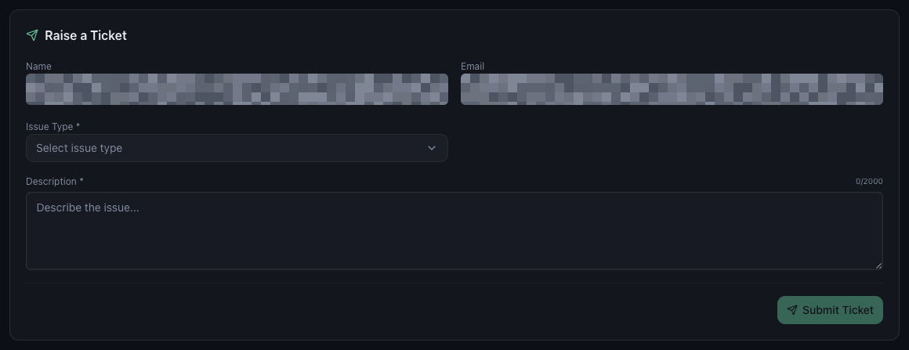
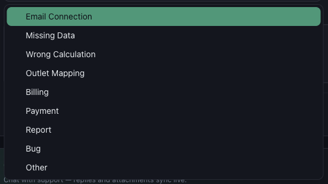
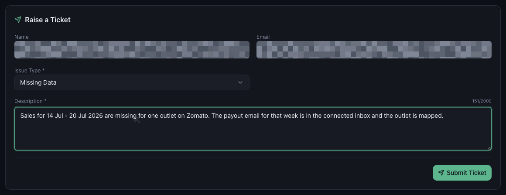

# How to Raise a Data Issue Support Ticket

*Data Issues · Read time: 3 minutes · Includes a short video · Last updated 25 August 2026*

When the checks have not solved it, raise a ticket from inside Mynt. A ticket with the right details is usually answered in one reply instead of three.

---

## Watch it done

**Video:** [Choosing an issue type, describing the problem and submitting the ticket](assets/raise-data-issue-ticket/demo.mp4)

## Where the form is

Open **Help & Support** from the left menu and scroll to **Raise a Ticket**. Your name and email are filled in for you.

*Only <strong>Issue Type</strong> and <strong>Description</strong> need your input*

## Pick the right issue type

The issue type decides who picks the ticket up, so it is worth getting right.

*Nine issue types &mdash; pick the closest one*

| | |
|---|---|
| **Missing Data** | A period, outlet or platform shows nothing. |
| **Wrong Calculation** | A figure is present but looks incorrect. |
| **Email Connection** | A mailbox will not connect, or has stopped syncing. |
| **Outlet Mapping** | A restaurant ID is on the wrong outlet, or will not save. |
| **Billing / Payment** | Invoices, licences, renewals or a failed payment. |
| **Report** | A report will not generate, download or arrive on schedule. |
| **Bug** | Something in the app is broken or behaving oddly. |
| **Other** | Anything that does not fit the list. |

## Write a description support can act on

Description takes up to 2,000 characters and a counter tracks what you have used. Include all five:

1. **Which outlet** &mdash; the outlet name or its licence ID.
2. **Which platform** &mdash; Zomato, Swiggy, Toing, or all of them.
3. **The exact dates** &mdash; for example 14 Jul &ndash; 20 Jul 2026.
4. **What you see, and what you expected** &mdash; both figures if it is a number problem.
5. **What you already checked** &mdash; filters, mapping, Email Integration status.

*Specific dates, one platform, one outlet &mdash; enough to investigate without a follow-up question*

> **Tip:** Say what you already ruled out. It stops the first reply being a list of checks you have already done.

## After you submit

Press **Submit Ticket**. The form clears, and the ticket appears under **Your Tickets** below, where you can carry on the conversation and attach files. Replies sync there live.

## Reaching support directly

If you cannot sign in at all, contact the team without the app:

| | |
|---|---|
| **Email** | contact@pyvot.in |
| **Phone** | +91 98366 66745 |
| **Phone** | +91 82407 91854 |

## Related guides

- [Why recent data is not showing yet](01-why-todays-recent-data-not-showing.md)
- [Data missing for certain dates](02-what-to-do-when-data-missing-certain-dates.md)
- [When dashboard numbers look wrong](03-what-to-do-when-dashboard-numbers-incorrect.md)

---

## Need help?

| Contact | Details |
|---------|---------|
| **Email** | contact@pyvot.in |
| **Phone** | +91 98366 66745 |
| **Phone** | +91 82407 91854 |

Or open **Help & Support** in Mynt and raise a ticket.
