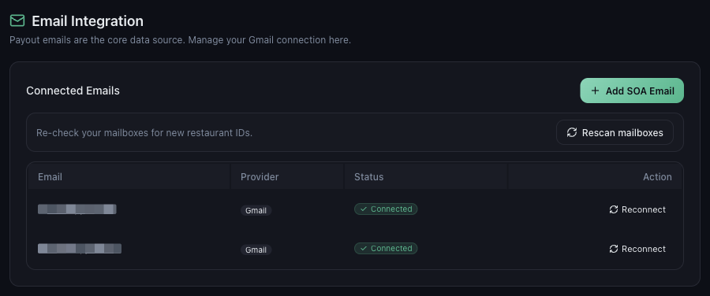

# How to Connect Your Gmail Account to Mynt

*Email Integration · Read time: 4 minutes · Article only · Last updated 25 August 2026*

Mynt builds your dashboards from the payout emails Zomato and Swiggy send you. Connecting the mailbox those emails arrive in is the one step everything else depends on.

---

## Before you start

- Know **which mailbox** receives your payout and settlement emails. It is often not the one you sign in to Mynt with.
- Be signed in to that Google account in this browser, or have its password to hand.

## Step 1 — Open the Email Integration panel

Go to **Settings**, then **Email Integration**. The panel explains its own job: payout emails are the core data source, and this is where the connection is managed.

*Settings &rarr; Email Integration &mdash; every mailbox Mynt reads, and its status*

## Step 2 — Add the mailbox

1. Press **Add SOA Email**.
2. Google asks which account to use. Pick the mailbox that receives payout emails.
3. Google then lists what Mynt is asking for. Read it, then approve.
4. You are returned to Mynt, and the mailbox appears in **Connected Emails**.

The Google screens are Google&rsquo;s own, not Mynt&rsquo;s &mdash; your password is never typed into Mynt. See [understanding Google and Gmail permissions](../security/02-understanding-google-gmail-permissions.md) for what those screens look like and what each permission means.

## Step 3 — Confirm it worked

The mailbox should show **Gmail** as its provider and a green **Connected** badge. If it does not, see [reconnecting a mailbox](06-how-to-reconnect-gmail-when-connection-expires.md).

> **Tip:** You can connect **more than one** mailbox. If Zomato mail goes to one address and Swiggy mail to another, add both &mdash; Mynt reads all of them.

## What happens next

1. Mynt reads the payout emails already sitting in that mailbox.
2. It picks out the restaurant IDs it finds and offers them for mapping.
3. You map each ID to an outlet in **Settings → Outlet Mapping**.
4. Dashboards fill in. See [how often Mynt syncs](05-how-often-sync.md).

## Common questions

**Does Mynt read all my email?** — The Gmail permission is read-only and Mynt looks for payout and settlement mail from the delivery platforms.

**Can I connect a non-Gmail mailbox?** — The connector is built for Gmail. If your payout mail arrives elsewhere, forward it to a connected Gmail address.

**I connected the wrong mailbox.** — Add the right one. See [changing the connected account](08-how-to-disconnect-or-change-gmail-account.md).

## Related guides

- [What permissions Mynt asks for](02-gmail-permissions.md)
- [Checking sync status](04-check-email-sync-status.md)
- [Mapping the outlets it finds](../outlet-mapping/02-how-to-map-zomato-swiggy-platform-outlets.md)

---

## Need help?

| Contact | Details |
|---------|---------|
| **Email** | contact@pyvot.in |
| **Phone** | +91 98366 66745 |
| **Phone** | +91 82407 91854 |

Or open **Help & Support** in Mynt and raise a ticket.
