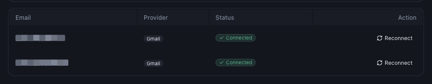

# What Gmail Permissions Does Mynt Require?

*Email Integration · Read time: 3 minutes · Article only · Last updated 25 August 2026*

Mynt asks Google for read-only access to your Gmail. That is the whole ask, and it is the minimum that makes the product work.

---

## What Mynt asks for

| | |
|---|---|
| **Read your Gmail messages** | To find and read the payout and settlement emails Zomato and Swiggy send you. |
| **Your email address** | So Mynt can show you which mailbox is connected. |

The Gmail permission is **read-only**. That is enforced by Google, not merely promised by us &mdash; the token Mynt holds cannot send, delete or alter anything in your mailbox.

## What Mynt cannot do

| | |
|---|---|
| **Send email as you** | Never. Read-only access does not permit it. |
| **Delete or edit your email** | Never, for the same reason. |
| **Read your Drive, Calendar or Contacts** | Never &mdash; those permissions are not requested at all. |
| **Change your Google password or settings** | Never. |

## Confirming a mailbox is connected

In **Settings → Email Integration**, a connected mailbox carries a green badge.

*Green <strong>Connected</strong> means Mynt currently holds a valid read-only token for that mailbox*

## Withdrawing access

You can revoke Mynt from Google at any time at [Google Account → Third-party access](https://myaccount.google.com/permissions). Do that and Mynt stops receiving new email immediately. Tell support afterwards so the Mynt side is cleaned up too &mdash; see [disconnecting or changing the account](08-how-to-disconnect-or-change-gmail-account.md).

> **Tip:** Revoking access does not delete the data Mynt has already collected. Ask support if you want that removed as well.

## Related guides

- [Connecting your Gmail account](01-connect-gmail-account.md)
- [The Google screens, step by step](../security/02-understanding-google-gmail-permissions.md)
- [How Mynt protects your business data](../security/03-how-mynt-protects-business-data.md)

---

## Need help?

| Contact | Details |
|---------|---------|
| **Email** | contact@pyvot.in |
| **Phone** | +91 98366 66745 |
| **Phone** | +91 82407 91854 |

Or open **Help & Support** in Mynt and raise a ticket.
