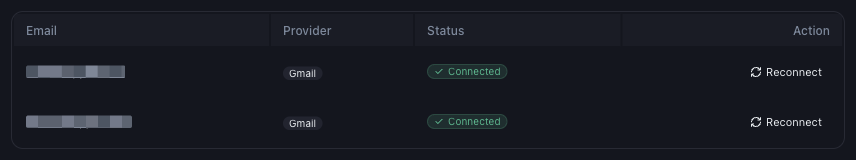
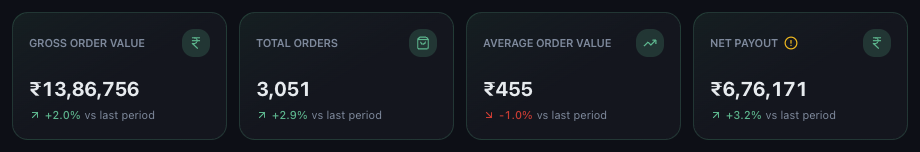

# How Mynt Uses Your Emails to Build Your Dashboards

*Email Integration · Read time: 4 minutes · Article only · Last updated 25 August 2026*

Every figure in Mynt traces back to an email a platform sent you. Knowing that chain explains most of what people find surprising about the numbers.

---

## The chain, end to end

1. Zomato or Swiggy sends a payout or settlement email to your mailbox.
2. Mynt reads it &mdash; read-only &mdash; and extracts the figures and the restaurant ID.
3. The restaurant ID is matched to one of your outlets through outlet mapping.
4. The figures are filed under that outlet and appear on your dashboards.

## Which mailboxes are in play

*Mynt reads every mailbox listed here &mdash; more than one is normal*

## What you get out of it

*Gross order value, orders, average order value and net payout &mdash; all derived from settlement emails*

## What this explains

| | |
|---|---|
| **Why data is not live** | A platform sends settlement mail on its payout cycle, often weekly &mdash; not per order. |
| **Why an unmapped outlet shows nothing** | Its restaurant ID has no outlet to file figures under, so they are skipped. |
| **Why Mynt and the platform app disagree** | Platforms report by order date; settlements are by payout cycle, net of refunds and fees. |
| **Why a missing email means missing data** | There is no other source. If the email never arrived, the period cannot be reconstructed. |

> **Tip:** Do not delete payout emails from the connected mailbox. They are the audit trail Mynt reads from, and re-processing a period needs them.

## Related guides

- [How often Mynt syncs](05-how-often-sync.md)
- [Why recent data is not showing yet](../data-issues/01-why-todays-recent-data-not-showing.md)
- [What outlet mapping is](../outlet-mapping/01-what-is-outlet-mapping-and-why-required.md)

---

## Need help?

| Contact | Details |
|---------|---------|
| **Email** | contact@pyvot.in |
| **Phone** | +91 98366 66745 |
| **Phone** | +91 82407 91854 |

Or open **Help & Support** in Mynt and raise a ticket.
