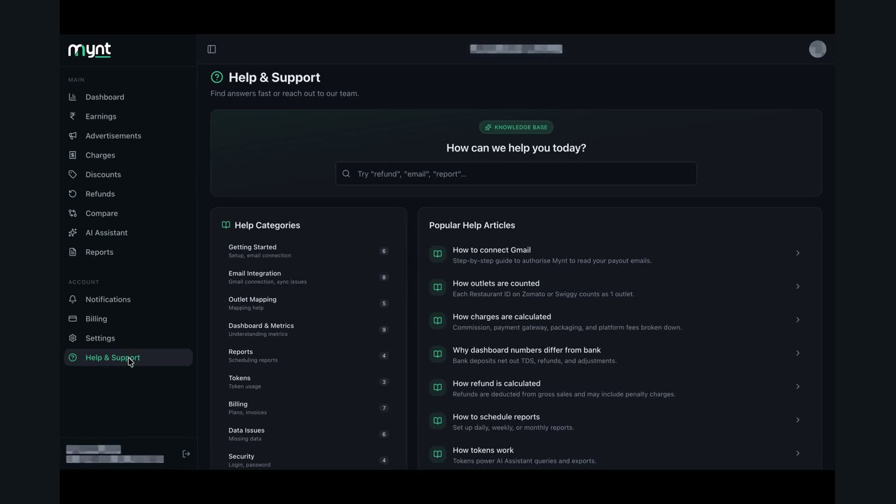

# How to Check Your Email Sync Status

*Email Integration · Read time: 3 minutes · Includes a short video · Last updated 25 August 2026*

Two places tell you whether email is flowing: how fresh your data is, and whether the fetch stage is healthy. Check both before assuming something is broken.

---

## Watch it done

**Video:** [The three-stop check: data freshness, the mailbox, then the fetch stage](assets/check-email-sync-status/demo.mp4)

## Check 1 — how fresh the data is

The **LAST UPDATED** chip on the dashboard names the most recent day Mynt holds data for.

*If this is several days old, no newer payout email has been processed*

## Check 2 — is the fetch stage working

Open **Help & Support** and look at **System Status**. **Email Fetch** is the stage that reads your mailboxes.

*<strong>Working</strong> means Mynt is reading mailboxes normally*

## Check 3 — is the mailbox still connected

In **Settings → Email Integration**, every mailbox should carry a green **Connected** badge. Anything else means Mynt has lost access &mdash; see [reconnecting](06-how-to-reconnect-gmail-when-connection-expires.md).

## Reading the three together

| | |
|---|---|
| **Fresh data, Working, Connected** | Nothing wrong. Any gap is on the platform&rsquo;s side, or a filter. |
| **Stale data, Working, Connected** | No new payout email has arrived. Check the mailbox directly. |
| **Stale data, Working, not Connected** | Access lapsed. Reconnect the mailbox. |
| **Stale data, Email Fetch not Working** | A Mynt-side issue. Raise a ticket with the time you noticed it. |

## Related guides

- [How often Mynt syncs](05-how-often-sync.md)
- [Connected but data still missing](07-gmail-connected-but-data-missing-troubleshooting.md)
- [Raising a ticket](../data-issues/06-how-to-raise-data-issue-support-ticket.md)

---

## Need help?

| Contact | Details |
|---------|---------|
| **Email** | contact@pyvot.in |
| **Phone** | +91 98366 66745 |
| **Phone** | +91 82407 91854 |

Or open **Help & Support** in Mynt and raise a ticket.
