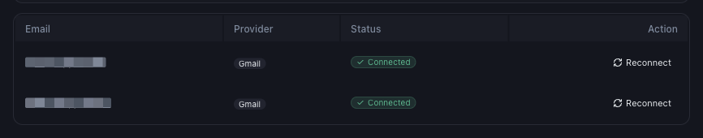

# How to Reconnect Gmail When the Connection Expires

*Email Integration · Read time: 3 minutes · Article only · Last updated 25 August 2026*

Google access can lapse &mdash; a password change, a revoked token, a security review. Reconnecting takes under a minute and no data is lost.

---

## How you will notice

- The dashboard stops moving and **LAST UPDATED** goes stale.
- The mailbox no longer shows a green **Connected** badge.

## Reconnecting

Each mailbox row carries its own **Reconnect** action.

*One <strong>Reconnect</strong> per mailbox &mdash; make sure you press the one on the right row*

1. Go to **Settings → Email Integration**.
2. Find the mailbox in **Connected Emails**.
3. Press **Reconnect** on that row.
4. Sign in to that Google account and approve the same read-only permission as before.
5. Confirm the badge is green again.

> **Tip:** Reconnect the *same* address. Connecting a different mailbox does not restore the old one &mdash; it adds a second one.

## What happens to the gap

Payout emails that arrived while access was lapsed are still sitting in the mailbox, so they can be read once the connection is restored. If a period stays empty afterwards, [raise a ticket](../data-issues/06-how-to-raise-data-issue-support-ticket.md) with the exact dates and ask for it to be reprocessed.

## If reconnecting does not stick

1. Confirm you are signing in as the mailbox that receives payout mail, not the address you use for Mynt.
2. Check [Google Account → Third-party access](https://myaccount.google.com/permissions) in case Mynt was revoked there.
3. Try a browser where you are not signed in to several Google accounts at once.
4. Still failing? Raise a ticket with the mailbox address and the time you tried.

## Related guides

- [Checking sync status](04-check-email-sync-status.md)
- [What permissions Mynt asks for](02-gmail-permissions.md)
- [Connected but data still missing](07-gmail-connected-but-data-missing-troubleshooting.md)

---

## Need help?

| Contact | Details |
|---------|---------|
| **Email** | contact@pyvot.in |
| **Phone** | +91 98366 66745 |
| **Phone** | +91 82407 91854 |

Or open **Help & Support** in Mynt and raise a ticket.
