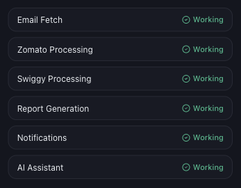

# Gmail Is Connected but My Data Is Missing

*Email Integration · Read time: 5 minutes · Article only · Last updated 25 August 2026*

The badge is green and the dashboard is still empty. Work through these four checks in order &mdash; the cause is almost always one of them.

---

## Check 1 — is the platform stage healthy?

Email arriving is only the first stage. **Help & Support → System Status** lists each platform separately, so one can be degraded while the other is fine.

*Zomato and Swiggy are processed separately &mdash; check both*

## Check 2 — is the outlet mapped?

A connected mailbox whose restaurant IDs are not mapped produces nothing. Open **Settings → Outlet Mapping** and confirm the **Unmapped** count is zero and no row reads **Not mapped**. See [how mapping affects your data](../data-issues/05-how-incorrect-outlet-mapping-affects-data.md).

## Check 3 — is it the right mailbox?

This is the most common cause of all. Mynt can be connected perfectly to a mailbox that never receives payout email. Open the connected mailbox and search for a recent Zomato or Swiggy settlement email. If there is none, connect the mailbox that does receive them &mdash; see [connecting a Gmail account](01-connect-gmail-account.md).

## Check 4 — are the filters hiding it?

1. Set **DATE** to a range that definitely covers the period.
2. Set **PLATFORM** to **All Platforms**.
3. Use **Select all** in the outlet list.
4. Press **Reset** to clear every filter and look again.

## Still nothing?

[Raise a ticket](../data-issues/06-how-to-raise-data-issue-support-ticket.md) with issue type **Missing Data** and include the mailbox address, the outlet, the exact dates, the platform, and which of these four checks you have already done.

## Related guides

- [Checking sync status](04-check-email-sync-status.md)
- [Why one platform can be missing](../data-issues/04-why-zomato-swiggy-data-missing-incomplete.md)
- [When dashboard numbers look wrong](../data-issues/03-what-to-do-when-dashboard-numbers-incorrect.md)

---

## Need help?

| Contact | Details |
|---------|---------|
| **Email** | contact@pyvot.in |
| **Phone** | +91 98366 66745 |
| **Phone** | +91 82407 91854 |

Or open **Help & Support** in Mynt and raise a ticket.
