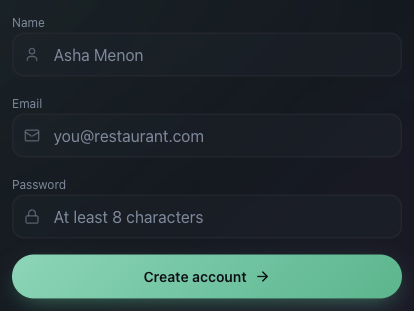
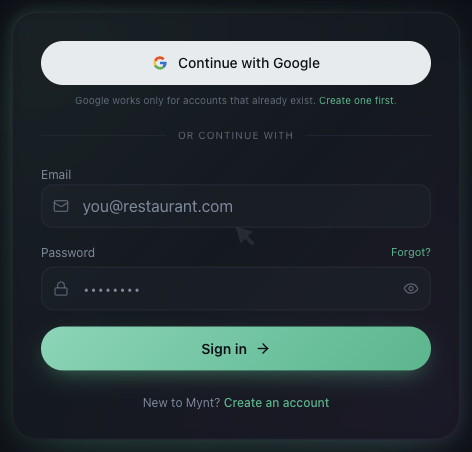

# How to Create Your Mynt Account and Sign In

*Getting Started · Read time: 3 minutes · Article only · Last updated 25 August 2026*

Two ways in: an email address and password, or Continue with Google. One of them only works if an account already exists.

---

## Creating an account

From the sign-in page, choose **Create an account**.

*Creating the account is the first of the five setup steps*

## Signing in

*Continue with Google, or an email address and password*

| | |
|---|---|
| **Continue with Google** | Works only if a Mynt account already exists for that Google address. It signs you in; it does not create an account. |
| **Email and password** | The address you registered with, and your password. |
| **Forgot?** | Sends a reset link to your registered address. |

> **Tip:** The address you sign in with does not have to be the mailbox Mynt reads payout emails from. They are separate, and it is normal for them to differ.

## After signing in

You land on the dashboard. If your business profile is incomplete, finish that first &mdash; see [completing your business profile](03-how-to-complete-your-business-profile.md).

## Trouble signing in

1. Check you are using the registered address, not the payout mailbox.
2. Use **Forgot?** to reset the password.
3. If **Continue with Google** fails, the account may have been created with an email and password instead &mdash; use that.
4. Still stuck? Contact support.

## Related guides

- [The complete setup guide](01-getting-started-with-mynt-complete-setup-guide.md)
- [How sign-in and account access work](../security/01-how-sign-in-account-access-work.md)
- [Signing out and removing access](../security/04-how-to-disconnect-sign-out-remove-access.md)

---

## Need help?

| Contact | Details |
|---------|---------|
| **Email** | contact@pyvot.in |
| **Phone** | +91 98366 66745 |
| **Phone** | +91 82407 91854 |

Or open **Help & Support** in Mynt and raise a ticket.
