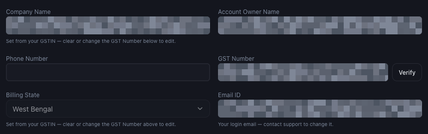

# How to Complete Your Business Profile

*Getting Started · Read time: 3 minutes · Article only · Last updated 25 August 2026*

Your profile is what appears on every invoice Mynt raises. Get it right before your first purchase &mdash; an issued invoice cannot be changed afterwards.

---

## Where it lives

Go to **Settings → Account**.

*GST number first &mdash; company name and billing state follow from it*

## Fill it in this order

1. Enter your **GST Number** and press **Verify**.
2. Check the **Company Name** and **Billing State** that appear &mdash; both are taken from the verified GSTIN.
3. Add your **Billing Address**.
4. Add the **Account Owner Name** and **Phone Number**.
5. Press **Save Changes**.

| | |
|---|---|
| **Company Name** | Read-only once a GSTIN is verified. Change or clear the GST number to edit it. |
| **Billing State** | Also derived from the GSTIN. It determines how GST is applied to your invoices. |
| **Email ID** | Your login address. Read-only &mdash; contact support to change it. |
| **Billing Address** | Printed on every invoice. |

> **Tip:** Enter the GSTIN *before* buying anything. A GSTIN cannot be added to an invoice that has already been issued.

## Related guides

- [Payments, GST and billing details](../billing/06-how-payments-gst-billing-details-work.md)
- [Adding your first brand and outlet](04-how-to-add-your-first-brand-and-outlet.md)
- [The complete setup guide](01-getting-started-with-mynt-complete-setup-guide.md)

---

## Need help?

| Contact | Details |
|---------|---------|
| **Email** | contact@pyvot.in |
| **Phone** | +91 98366 66745 |
| **Phone** | +91 82407 91854 |

Or open **Help & Support** in Mynt and raise a ticket.
