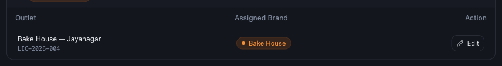
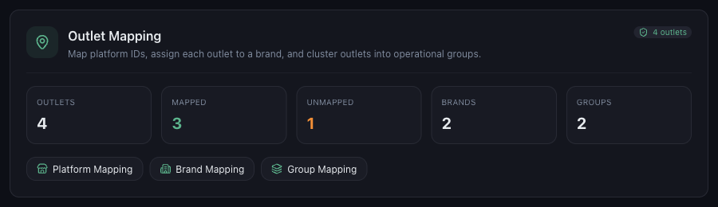

# How to Add Your First Brand and Outlet

*Getting Started · Read time: 4 minutes · Article only · Last updated 25 August 2026*

Outlets are your physical locations. Brands and groups are the two ways to organise them &mdash; useful the moment you have more than one.

---

## The three levels

| | |
|---|---|
| **Outlet** | One physical location, holding one restaurant ID per platform. |
| **Brand** | The name customers order under. Several outlets can share one brand. |
| **Group** | Your own operational grouping &mdash; by city, region or manager. |

## Assigning a brand

In **Settings → Outlet Mapping → Brand Mapping**, create the brand, then assign each outlet to it.

*Each outlet carries one brand*

1. Type the brand name and press **Add brand**.
2. Find the outlet in the list below.
3. Press **Edit** on that row and pick the brand.
4. Press **Save**.

## Assigning a group

*Groups are yours to define &mdash; by city, region, or however you actually run the business*

Brands and groups are independent: an outlet can be *Curry Story* by brand and *South Bengaluru* by group at the same time. Both appear in **VIEW BY** on the dashboard, so the way you organise here is the way you can slice your numbers later.

## Then map the platform IDs

An outlet with no restaurant IDs collects nothing, whatever brand it carries. See [how to map Zomato and Swiggy outlets](../outlet-mapping/02-how-to-map-zomato-swiggy-platform-outlets.md).

> **Tip:** Set brands and groups up before you have twenty outlets. Retrofitting them is tedious, and every dashboard view depends on them.

## Related guides

- [Multiple outlets, brands and groups](../outlet-mapping/04-how-outlet-mapping-works-multiple-outlets-chains-groups.md)
- [Connecting your data sources](05-how-to-connect-your-data-sources-to-mynt.md)
- [Using the filters](../dashboard-metrics/02-how-to-use-filters-date-platform-restaurant-chain-group.md)

---

## Need help?

| Contact | Details |
|---------|---------|
| **Email** | contact@pyvot.in |
| **Phone** | +91 98366 66745 |
| **Phone** | +91 82407 91854 |

Or open **Help & Support** in Mynt and raise a ticket.
