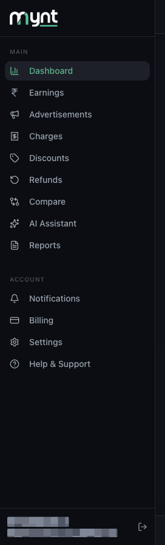

# Finding Your Way Around Mynt: Navigation, Filters and Views

*Getting Started · Read time: 4 minutes · Article only · Last updated 25 August 2026*

Mynt is one sidebar and one filter panel. Learn those two and every page makes sense.

---

## The sidebar

*MAIN is your numbers; ACCOUNT is everything about the account itself*

| | |
|---|---|
| **Dashboard** | The overview &mdash; every headline metric for the selected period. |
| **Earnings** | Performance by hour, mealtime and day type. |
| **Advertisements** | Ad spend and its sales impact. |
| **Charges** | Platform charges broken down per outlet. |
| **Discounts** | Coupon performance and discount burn. |
| **Refunds** | Cancellations and what you were still paid. |
| **Compare** | Side-by-side comparisons. |
| **AI Assistant** | Ask questions of your own data. |
| **Reports** | Generate, schedule and download reports. |
| **Notifications / Billing / Settings / Help & Support** | Account, licences, configuration and support. |

## The filter panel

Every metric page carries the same four controls: **DATE**, **PLATFORM**, **VIEW BY** and the outlet selector. They apply to everything on the page, and nothing changes until you press **Apply**.

*<strong>VIEW BY</strong> decides whether rows are outlets, brands or groups*

Full detail: [using the filters](../dashboard-metrics/02-how-to-use-filters-date-platform-restaurant-chain-group.md).

## The three chips under every title

| | |
|---|---|
| **LAST UPDATED** | The newest day Mynt holds data for. |
| **The period chip** | What you are looking at, with exact dates. |
| **LAST PERIOD** | What every percentage is measured against. |

> **Tip:** When a page looks wrong, press **Reset** in the filter panel and read it again. It clears the most likely cause in one click.

## Related guides

- [Understanding the dashboard](../dashboard-metrics/01-understanding-the-mynt-dashboard.md)
- [Using the filters](../dashboard-metrics/02-how-to-use-filters-date-platform-restaurant-chain-group.md)
- [The complete setup guide](01-getting-started-with-mynt-complete-setup-guide.md)

---

## Need help?

| Contact | Details |
|---------|---------|
| **Email** | contact@pyvot.in |
| **Phone** | +91 98366 66745 |
| **Phone** | +91 82407 91854 |

Or open **Help & Support** in Mynt and raise a ticket.
