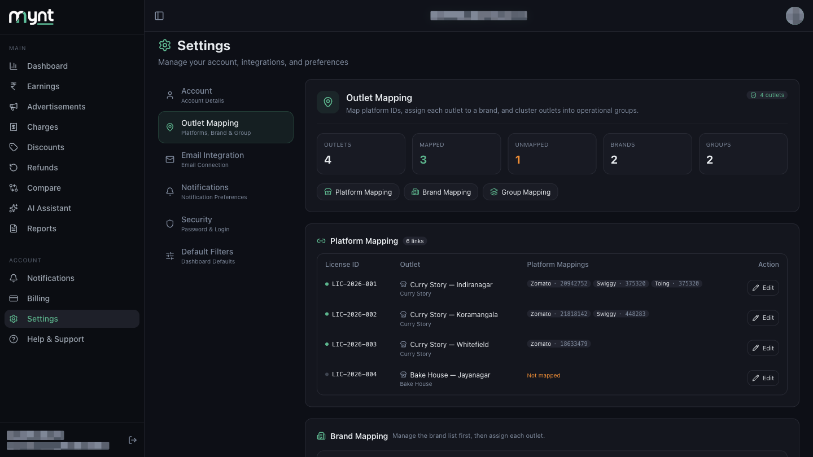
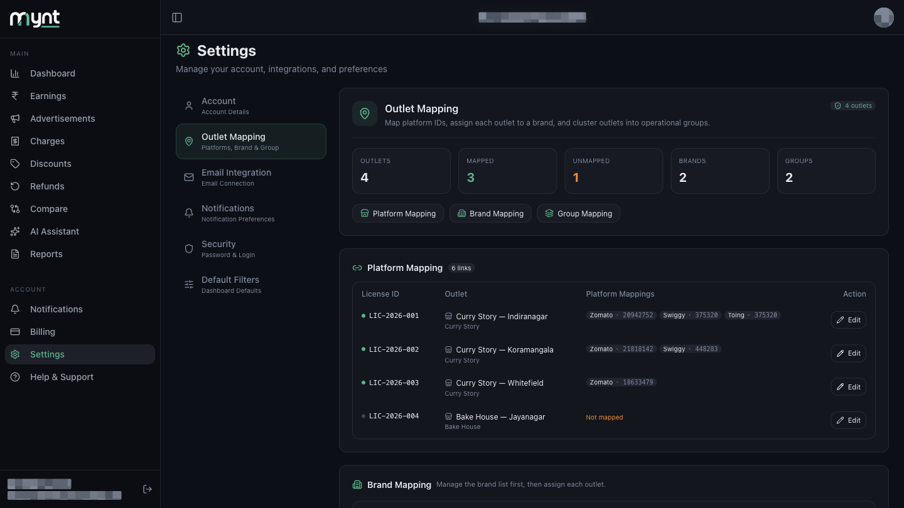
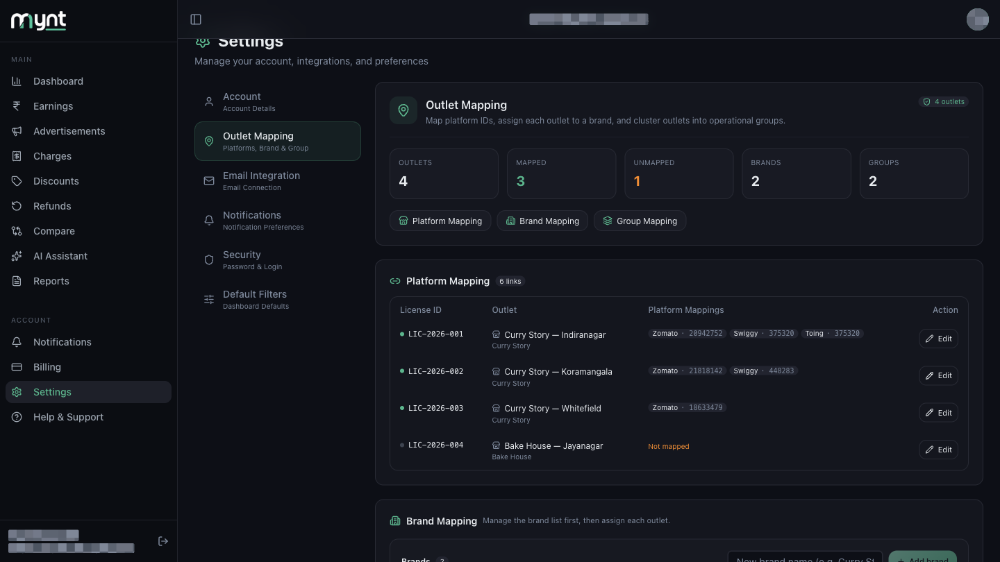

# What Is Outlet Mapping and Why Is It Required?

*Outlet Mapping · Read time: 3 minutes · Article only · Last updated 25 August 2026*

---

## Hello!

**Hello!** Zomato and Swiggy each give your restaurant their own ID number. Outlet mapping tells Mynt which of those IDs belong to which of your outlets, so your payout emails land against the right shop.

---

## What is outlet mapping?

Every platform knows your outlet by a number, not by its name. Zomato might call your Indiranagar shop `20942752`; Swiggy calls the same shop `375320`.

Outlet mapping is where you link those numbers to the outlet in Mynt. Once linked, every payout email for that number is counted against that outlet.

---

## Why is it required?

| Without mapping | With mapping |
|-----------------|--------------|
| Payout emails arrive but Mynt cannot tell which outlet they belong to | Every payout lands against the right outlet |
| Dashboard shows blanks or lumps everything together | Sales, charges and payouts split correctly per outlet |
| Reports cannot be filtered by outlet, brand or group | Filters work properly |

---

## Where to find it

Open **Settings** from the left menu, then tap **Outlet Mapping**.

---

## What you see on the page

The top of the page summarises where you stand:

| Card | Meaning |
|------|---------|
| **Outlets** | Total active locations |
| **Mapped** | Outlets with at least one platform ID linked |
| **Unmapped** | Outlets still missing IDs — **turns orange when above zero** |
| **Brands** | How many brands are in your list |
| **Groups** | How many groups you have created |

Below the cards, three buttons — **Platform Mapping**, **Brand Mapping**, **Group Mapping** — jump straight to each section.

---

## Platform Mapping in brief

This is the section that actually matters for your data. Its table has four columns:

| Column | What it shows |
|--------|---------------|
| **License ID** | The licence covering that outlet, e.g. `LIC-2026-001` |
| **Outlet** | The outlet name, with its brand underneath |
| **Platform Mappings** | One tag per linked platform, e.g. `Zomato · 20942752` |
| **Action** | The **Edit** button for that row |

A **green dot** beside the licence ID means Mynt is collecting data for that outlet. A **grey dot** means it is not — usually because the outlet has no platform IDs linked yet.

An outlet with nothing linked shows **Not mapped** in orange.

---

## When should you map?

- **During onboarding** — mapping is one of the setup steps.
- **After connecting your payout email** — Mynt detects IDs from your emails, so the list to choose from fills up once mail is flowing.
- **Whenever you add an outlet** — a new outlet starts unmapped.

> **Tip:** Brand and Group mapping are optional and do not affect whether data arrives. Only **Platform Mapping** does that.

---

## Common questions

**Do I have to map every platform?** — Only the ones you actually trade on. An outlet on Zomato but not Swiggy just gets the Zomato link.

**What if I map the wrong ID?** — Open the row, change it, save. See [How to edit an existing outlet mapping](03-how-to-edit-existing-outlet-mapping.md).

**Does mapping change past data?** — Historic data stays where it is. New payouts follow the updated link.

---

## Related guides

- [How to map Zomato and Swiggy outlets](02-how-to-map-zomato-swiggy-platform-outlets.md)
- [How to edit an existing outlet mapping](03-how-to-edit-existing-outlet-mapping.md)
- [Brands, groups and multiple outlets](04-how-outlet-mapping-works-multiple-outlets-chains-groups.md)
- [Fixing incorrect, duplicate or unmapped outlets](05-how-to-fix-incorrect-duplicate-unmapped-outlets.md)

---

## Need help?

| Contact | Details |
|---------|---------|
| **Email** | contact@pyvot.in |
| **Phone** | +91 98366 66745 |
| **Phone** | +91 82407 91854 |

Or open **Help & Support** in Mynt and raise a ticket.
