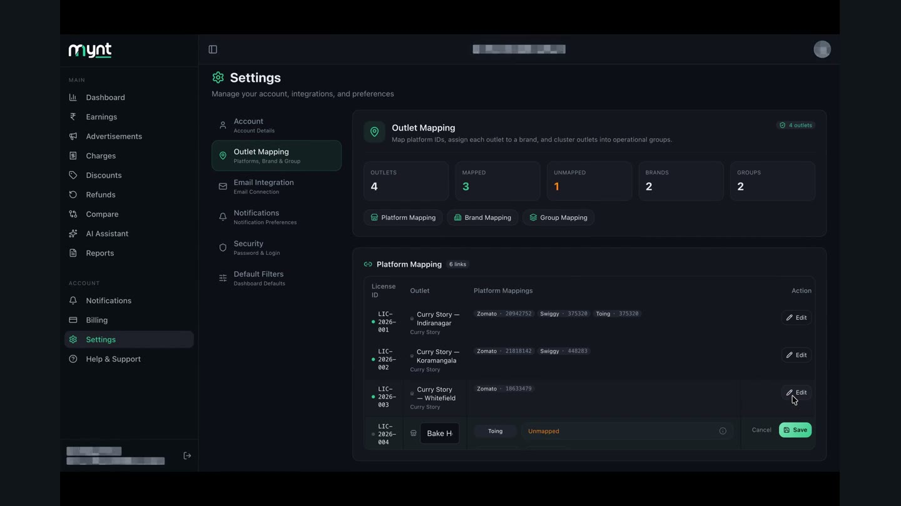
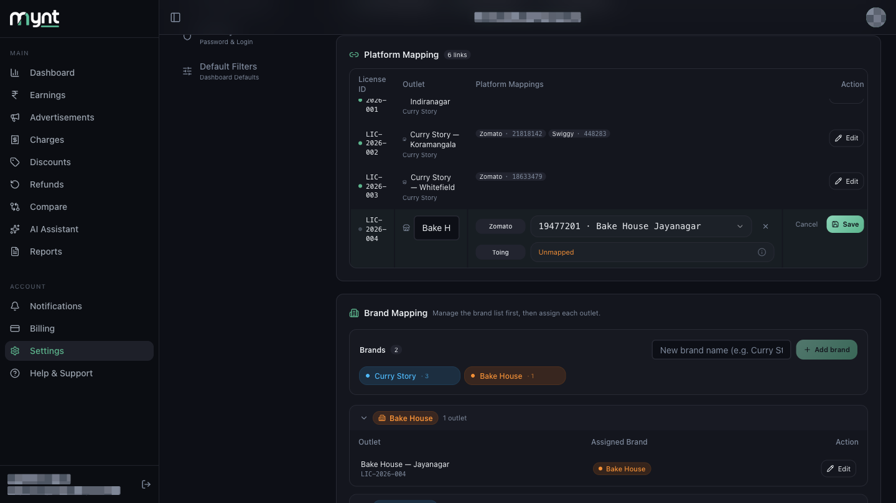
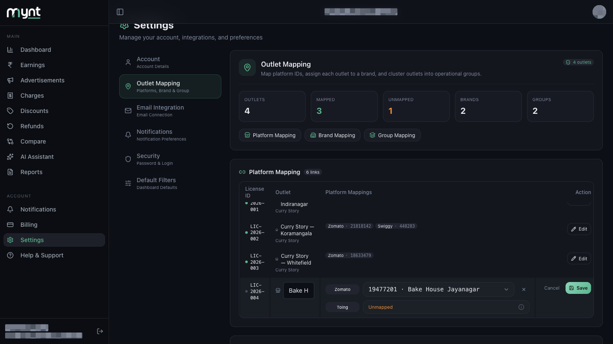
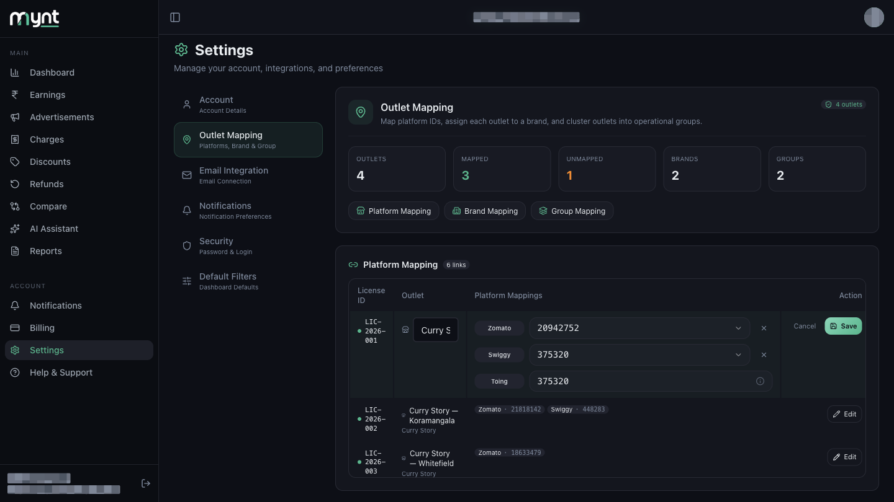
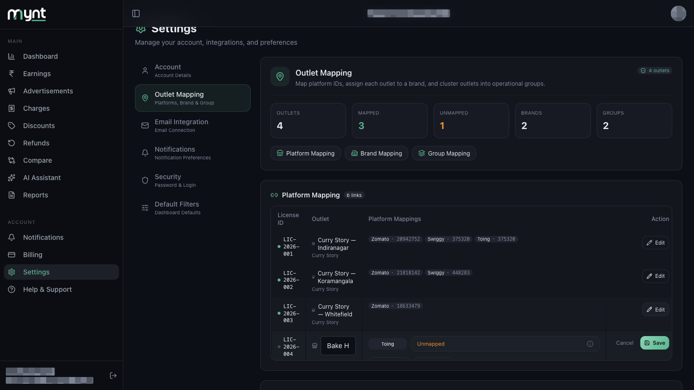
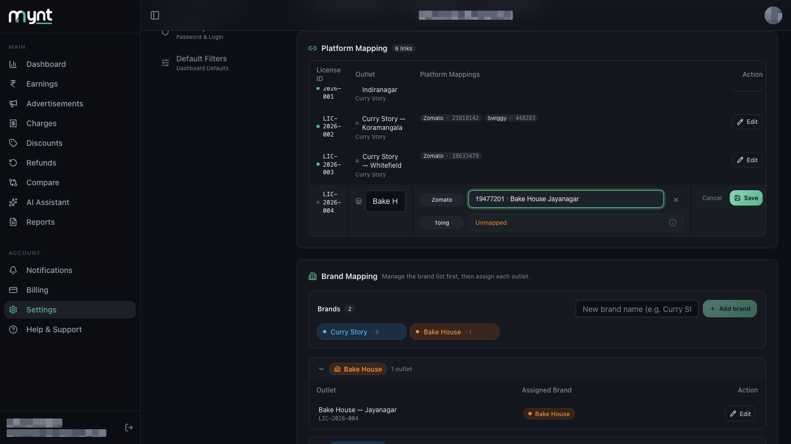
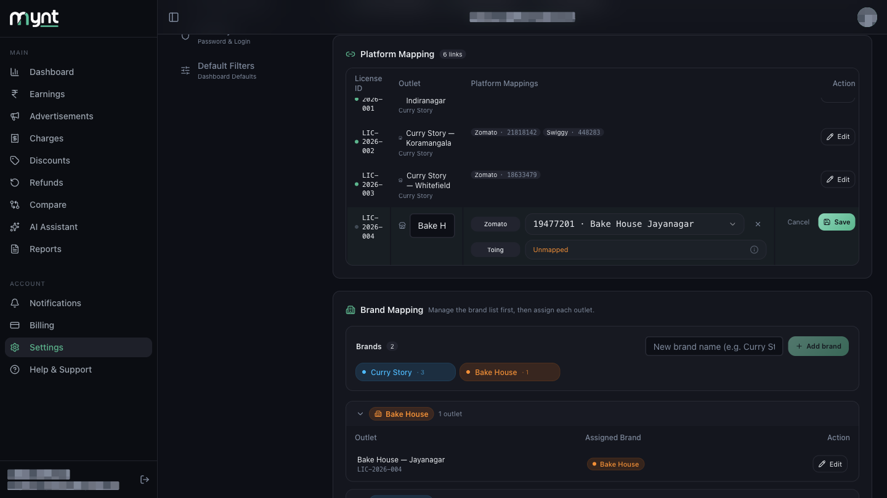

# How to Map Zomato and Swiggy Outlets

*Outlet Mapping · Read time: 5 minutes · Includes a short video · Last updated 25 August 2026*

---

## Hello!

**Hello!** Linking a Zomato or Swiggy restaurant ID to one of your outlets makes payouts for that ID count against the right shop.

---

## Watch this first

**[▶ Watch demo video](assets/map-zomato-swiggy-platform-outlets/demo.mp4)**

*Linking a Zomato ID to an outlet in Platform Mapping.*

---

## Before you start

- Your payout email should show **Connected** under **Settings → Email Integration**. Mynt reads restaurant IDs out of those emails, and the list you pick from is built from what it finds.
- Have the outlet in mind. Each platform ID can belong to only one outlet in your account.

---

## Step-by-step

### Step 1 — Open Outlet Mapping

Left menu → **Settings** → **Outlet Mapping**.

---

### Step 2 — Go to Platform Mapping

Tap **Platform Mapping** in the row of buttons, or scroll down to the Platform Mapping card. Outlets with nothing linked show **Not mapped** in orange.

---

### Step 3 — Tap Edit on the outlet

Find the outlet's row and tap **Edit**. The row highlights and its fields become editable, with **Cancel** and **Save** on the right.

---

### Step 4 — Add the platform

Tap **+ Zomato** or **+ Swiggy** to add a platform link. Only platforms you have not already linked appear here.

> **Toing** is shown too, but you cannot edit it. Toing uses the same ID as Swiggy, so it fills in by itself once Swiggy is linked.

---

### Step 5 — Pick the restaurant ID

Tap the dropdown next to the platform name and choose the right ID. Where Mynt found a restaurant name in your payout email, the option reads **ID · restaurant name** to help you tell them apart.

If the dropdown is empty, Mynt has not detected any unused IDs for that platform yet. Check that your payout email is connected and give it time to sync.

---

### Step 6 — Save

Tap **Save**. The link is stored and Mynt starts counting that platform's payouts against this outlet. Repeat for each outlet, and for each platform separately.

---

## How do I know it worked?

- The row now shows a tag such as **Zomato · 20942752** instead of **Not mapped**.
- The **Mapped** count at the top goes up and **Unmapped** goes down.
- The dot beside the licence ID turns green once data starts arriving.
- Dashboard numbers for that outlet update within a few minutes.

---

## Common problems

| Problem | What it means |
|---------|---------------|
| **+ Zomato / + Swiggy missing** | You have already linked that platform for this outlet, or Mynt has not detected any ID for it |
| **Dropdown is empty** | No unused IDs detected yet — check Email Integration shows Connected |
| **"That platform ID is already registered"** | The ID belongs to another outlet. See [Fixing incorrect, duplicate or unmapped outlets](05-how-to-fix-incorrect-duplicate-unmapped-outlets.md) |
| **Toing cannot be edited** | Correct — it follows your Swiggy ID automatically |

---

## Related guides

- [What outlet mapping is](01-what-is-outlet-mapping-and-why-required.md)
- [How to edit an existing outlet mapping](03-how-to-edit-existing-outlet-mapping.md)
- [Fixing incorrect, duplicate or unmapped outlets](05-how-to-fix-incorrect-duplicate-unmapped-outlets.md)

---

## Need help?

| Contact | Details |
|---------|---------|
| **Email** | contact@pyvot.in |
| **Phone** | +91 98366 66745 |
| **Phone** | +91 82407 91854 |

Or open **Help & Support** in Mynt and raise a ticket.
