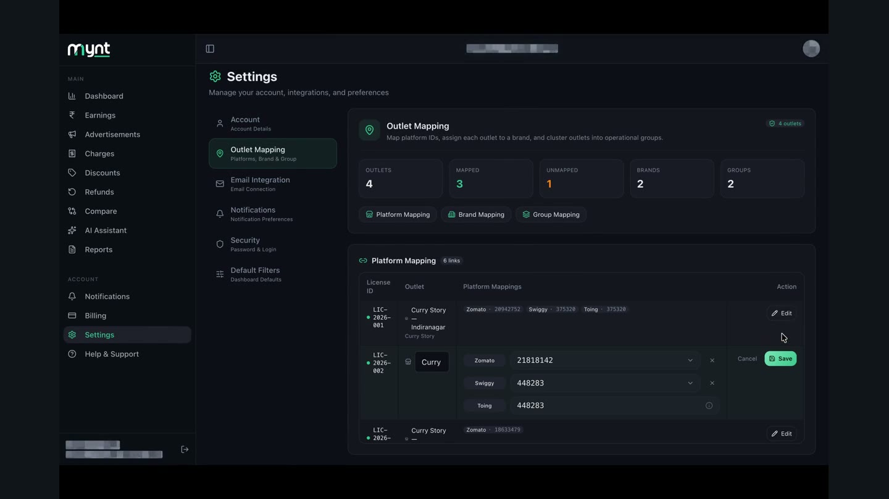
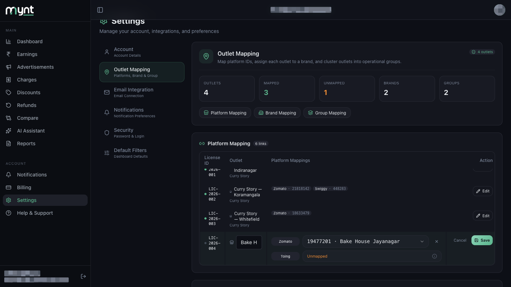
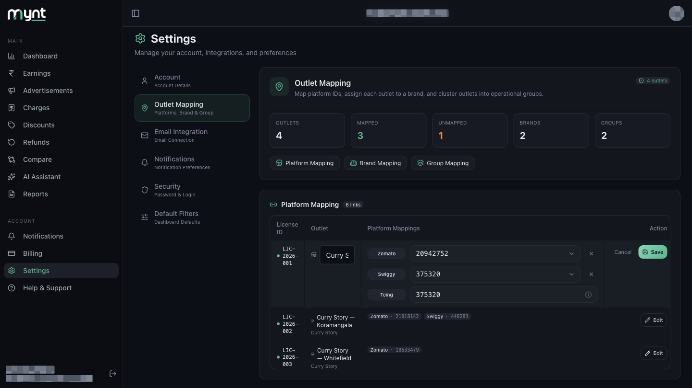
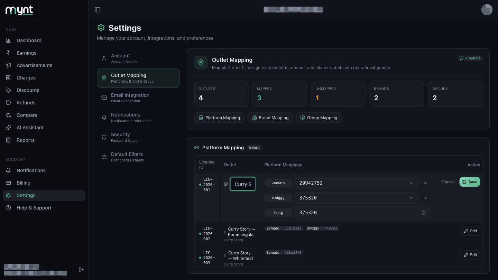

# How to Edit an Existing Outlet Mapping

*Outlet Mapping · Read time: 3 minutes · Includes a short video · Last updated 25 August 2026*

---

## Hello!

**Hello!** Renamed a shop, or linked the wrong restaurant ID? Everything in Platform Mapping can be changed from the same **Edit** button.

---

## Watch this first

**[▶ Watch demo video](assets/edit-existing-outlet-mapping/demo.mp4)**

*Renaming an outlet and removing a platform link.*

---

## Before you start

Have the correct restaurant ID to hand — from your payout email, or from the list Mynt has already detected.

---

## Step-by-step

### Step 1 — Find the outlet

Go to **Settings → Outlet Mapping** and scroll to **Platform Mapping**. Mapped outlets show a tag per platform, such as **Zomato · 20942752**. Unmapped ones show **Not mapped** in orange.

---

### Step 2 — Tap Edit

Tap **Edit** on that outlet's row. The row highlights and opens with **Cancel** and **Save** buttons.

---

### Step 3 — Change what you need

- **Outlet name** — tap the name box and type a new one.
- **Restaurant ID** — pick a different one from that platform's dropdown.
- **Add a platform** — tap **+ Zomato** or **+ Swiggy**.
- **Remove a platform** — tap the **×** beside it.

> **Toing** cannot be edited here. It follows your Swiggy ID automatically.

---

### Step 4 — Save

Tap **Save** to apply, or **Cancel** to discard.

Changes apply immediately. Historic data stays with the outlet; new payouts follow the updated ID.

---

## What you change elsewhere

| Section | What you change there |
|---------|----------------------|
| **Brand Mapping** | Which brand an outlet belongs to |
| **Group Mapping** | Which group an outlet belongs to |
| **Billing** | Which licence covers which outlet |

See [Brands, groups and multiple outlets](04-how-outlet-mapping-works-multiple-outlets-chains-groups.md).

---

## Common questions

**Will editing break my past data?** — No. Mynt keeps what it already collected and applies the new link going forward.

**Can I remove a platform link entirely?** — Yes. Tap **×** next to it, then **Save**. That outlet stops counting payouts from that platform.

**How soon do dashboards update?** — Usually within a few minutes.

**Why can't I edit Toing?** — Toing shares Swiggy's ID, so Mynt fills it in for you.

---

## Related guides

- [What outlet mapping is](01-what-is-outlet-mapping-and-why-required.md)
- [How to map Zomato and Swiggy outlets](02-how-to-map-zomato-swiggy-platform-outlets.md)
- [Fixing incorrect, duplicate or unmapped outlets](05-how-to-fix-incorrect-duplicate-unmapped-outlets.md)

---

## Need help?

| Contact | Details |
|---------|---------|
| **Email** | contact@pyvot.in |
| **Phone** | +91 98366 66745 |
| **Phone** | +91 82407 91854 |

Or open **Help & Support** in Mynt and raise a ticket.
