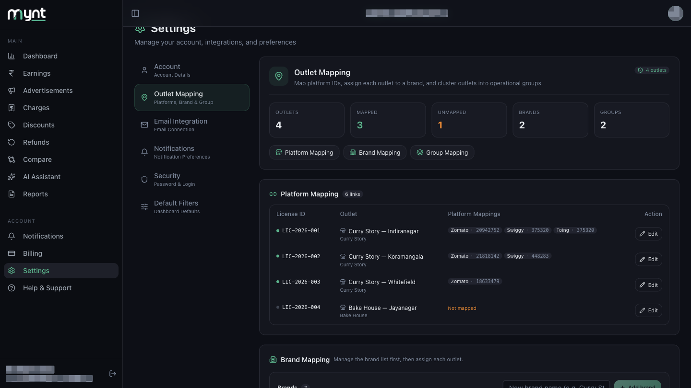
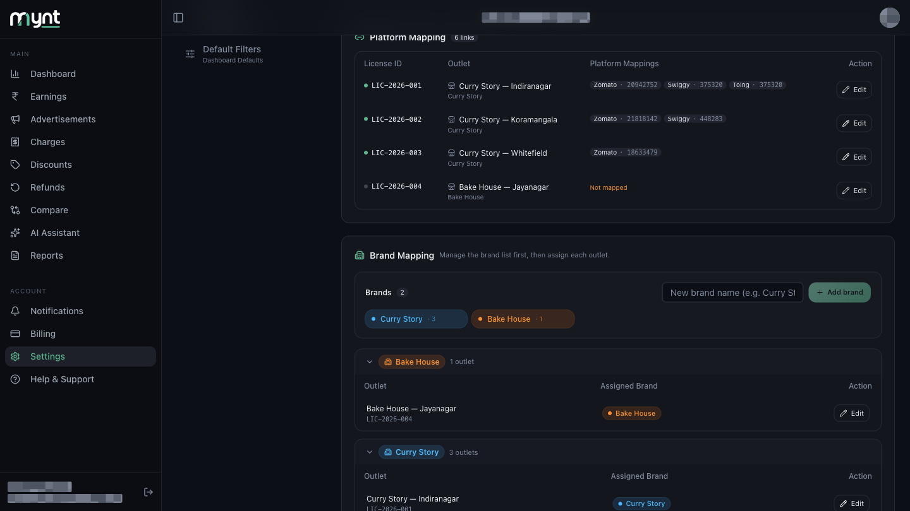
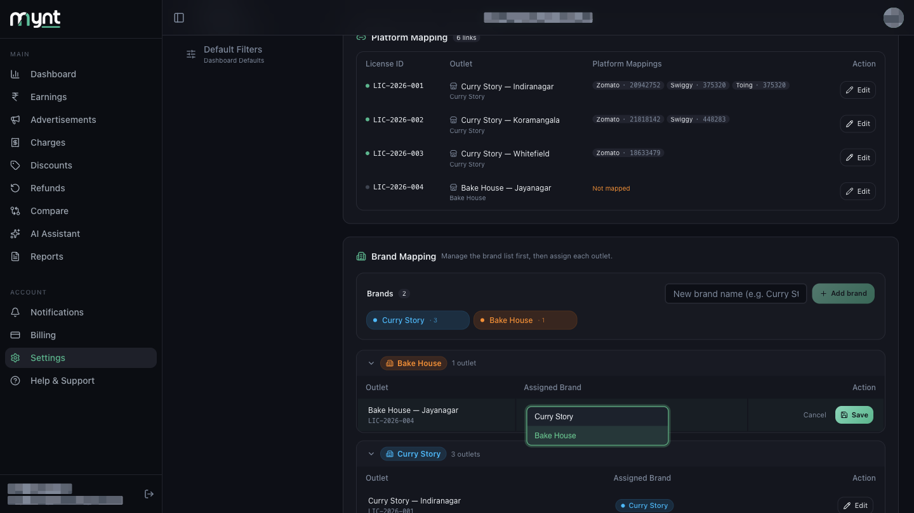
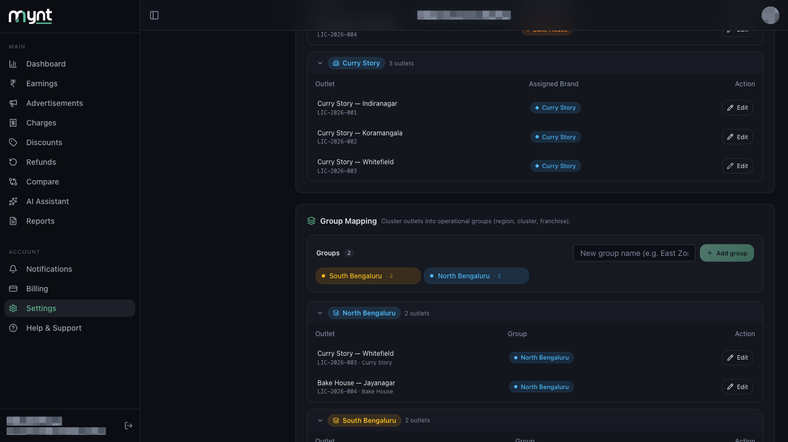

# How Outlet Mapping Works for Multiple Outlets, Brands and Groups

*Outlet Mapping · Read time: 4 minutes · Article only · Last updated 25 August 2026*

---

## Hello!

**Hello!** Running more than one shop, or more than one brand out of them? Mynt organises outlets in three layers. Only the first affects your data; the other two make filtering easier.

---

## The three layers

| Layer | What it does | Example |
|-------|--------------|---------|
| **Platform Mapping** | Links platform IDs to an outlet — **required for data to appear** | Zomato `20942752` → Curry Story — Indiranagar |
| **Brand Mapping** | Says which brand an outlet trades as | Curry Story — Indiranagar → **Curry Story** |
| **Group Mapping** | Clusters outlets however you like | Curry Story — Indiranagar → **South Bengaluru** |

Platform Mapping is required for data. Brand and Group are optional, but they are what let you filter Reports and Dashboard views later.

---

## Summary cards at the top

| Card | Meaning |
|------|---------|
| **Outlets** | Total active locations |
| **Mapped** | Outlets with at least one platform ID |
| **Unmapped** | Outlets still missing IDs — **orange when above zero** |
| **Brands** | Brands in your list |
| **Groups** | Groups you have created |

---

## Brand Mapping

Brands are managed in two parts: build the list first, then assign outlets to it.

### 1. The brand list

Type a name into **New brand name** and tap **+ Add brand**. Each brand then appears as a chip showing how many outlets use it.

Hover a chip to **Rename** or **Delete** it. A brand can only be deleted once no outlets are assigned to it — otherwise Mynt tells you how many still need reassigning.

### 2. Assign outlets to brands

Below the list, outlets are grouped into a bucket per brand, plus an **Unassigned** bucket. To move one, tap **Edit** on its row, pick a brand from the **Assigned Brand** dropdown, and save.

One outlet belongs to exactly one brand — never two.

---

## Group Mapping

Groups work the same way, for whatever grouping suits you — region, cluster, franchisee.

Add one with **New group name** → **+ Add group**. Outlets with no group sit under **Ungrouped**. To move an outlet, tap **Edit** on its row and pick a group.

---

## Example: a six-outlet business

| Outlet | Platform IDs | Brand | Group |
|--------|--------------|-------|-------|
| Indiranagar | Zomato + Swiggy | Curry Story | South Bengaluru |
| Koramangala | Zomato + Swiggy | Curry Story | South Bengaluru |
| Whitefield | Zomato | Curry Story | North Bengaluru |
| Jayanagar | Swiggy | Bake House | North Bengaluru |
| HSR Layout | Zomato + Swiggy | Bake House | South Bengaluru |
| Hebbal | Zomato | Bake House | North Bengaluru |

Reports can then be filtered to one brand ("Curry Story only") or one group ("North Bengaluru").

---

## Common questions

**Does brand or group mapping affect my data?** — No. Only Platform Mapping decides whether payouts are collected. Brands and groups only affect filtering.

**Can one outlet be in two brands?** — No. One outlet, one brand.

**Can I rename a brand later?** — Yes, hover its chip and tap Rename. Every outlet assigned to it follows automatically.

**What if I delete a group?** — Mynt blocks it while outlets are still assigned, and tells you how many to reassign first.

---

## Related guides

- [What outlet mapping is](01-what-is-outlet-mapping-and-why-required.md)
- [How to map Zomato and Swiggy outlets](02-how-to-map-zomato-swiggy-platform-outlets.md)
- [How to edit an existing outlet mapping](03-how-to-edit-existing-outlet-mapping.md)

---

## Need help?

| Contact | Details |
|---------|---------|
| **Email** | contact@pyvot.in |
| **Phone** | +91 98366 66745 |
| **Phone** | +91 82407 91854 |

Or open **Help & Support** in Mynt and raise a ticket.
