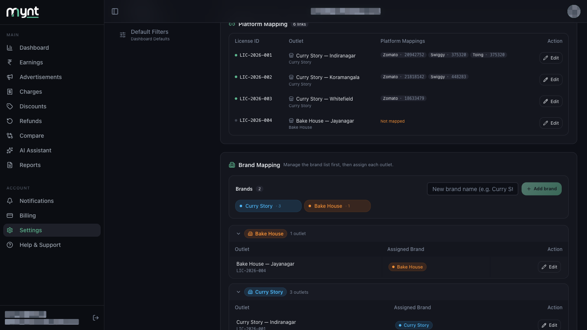
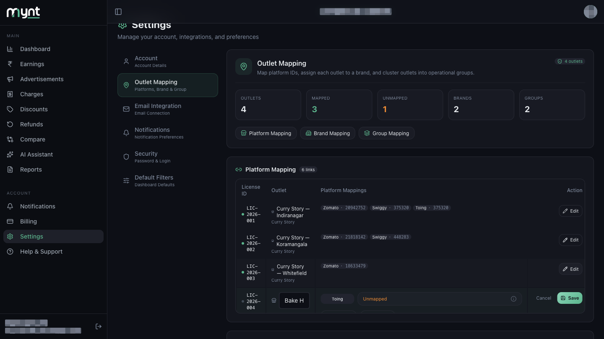
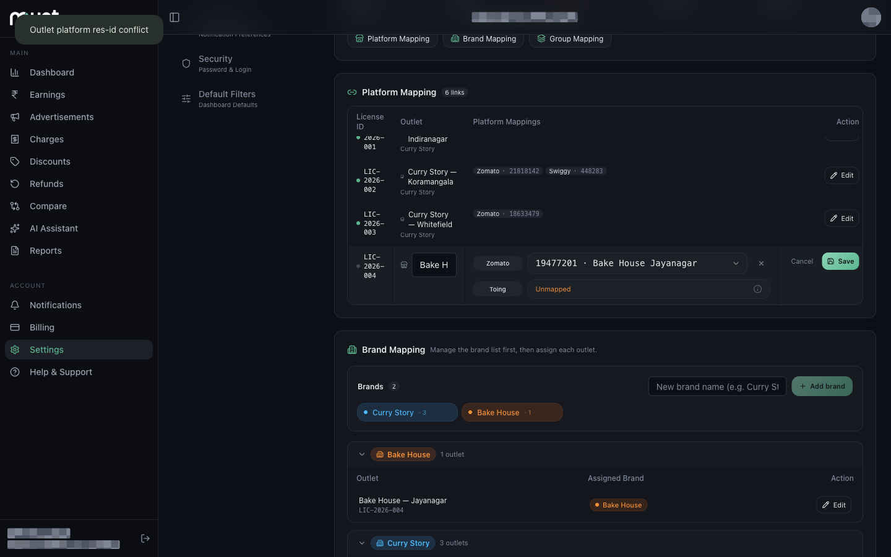

# How to Fix Incorrect, Duplicate or Unmapped Outlets

*Outlet Mapping · Read time: 4 minutes · Article only · Last updated 25 August 2026*

---

## Hello!

**Hello!** Missing numbers on your dashboard usually trace back to mapping. Five things commonly go wrong, and each has a fix.

---

## Problem 1 — Unmapped outlets

**Symptom:** the **Unmapped** card at the top is orange and above zero, and one or more rows show **Not mapped**.

**Fix:**

1. Go to **Settings → Outlet Mapping → Platform Mapping**.
2. Find the row showing **Not mapped**.
3. Tap **Edit**.
4. Tap **+ Zomato** or **+ Swiggy**.
5. Pick the right ID from the dropdown, then tap **Save**.

> **Tip:** If the dropdown is empty, Mynt has not detected that ID yet. Check **Settings → Email Integration** shows **Connected**, and give it time to read your payout mail.

---

## Problem 2 — The right ID on the wrong outlet

**Symptom:** one outlet shows another shop's sales.

**Fix:** open the row that wrongly holds the ID, tap **×** to remove it, then **Save**. Now open the correct outlet, add the platform, pick that ID and save.

Each platform ID can belong to only one outlet in your account, so it must be removed from the wrong one before it can be added to the right one.

---

## Problem 3 — "Outlet platform res-id conflict"

**Symptom:** you tap **Save** and this appears at the top of the page:

> Outlet platform res-id conflict

**What it means:** Mynt words this one for engineers, not for you. It means the restaurant ID is already linked to a *different Mynt account*, not just a different outlet of yours. This happens after an ownership change, or if the outlet was set up under another login.

**Fix:** you cannot move it yourself. Contact support with the platform, the restaurant ID and which outlet it should belong to, and they will move it across.

---

## Problem 4 — Some outlets blank on the dashboard

**Symptom:** totals look low, or one outlet contributes nothing.

**Check, in order:**

1. Is the outlet **mapped**? An unmapped outlet contributes nothing.
2. Is the dot beside its licence ID **green**? Grey means Mynt is not collecting for it — often because it has no platform IDs, or is not covered by your plan.
3. Is **Email Integration** showing **Connected**?
4. Is the dashboard date range one where that outlet actually traded?

---

## Problem 5 — Extra or duplicate outlet rows

**Symptom:** the same shop appears twice.

Outlets cannot be deleted from this screen. Map the platform IDs to whichever row you want to keep, leave the other unmapped, and contact support to merge or deactivate the spare.

---

## Quick reference

| Symptom | Fix |
|---------|-----|
| **Not mapped** in orange | Edit row → add platform → pick ID → Save |
| Wrong outlet's sales showing | Remove the ID from the wrong row, add it to the right one |
| "Outlet platform res-id conflict" | Contact support — only they can move it |
| Wrong outlet name | Edit row → change the name → Save |
| Grey dot beside the licence ID | Outlet not collecting — check mapping and your plan |
| Duplicate outlet rows | Map one, contact support about the other |

---

## Related guides

- [What outlet mapping is](01-what-is-outlet-mapping-and-why-required.md)
- [How to map Zomato and Swiggy outlets](02-how-to-map-zomato-swiggy-platform-outlets.md)
- [How to edit an existing outlet mapping](03-how-to-edit-existing-outlet-mapping.md)

---

## Need help?

| Contact | Details |
|---------|---------|
| **Email** | contact@pyvot.in |
| **Phone** | +91 98366 66745 |
| **Phone** | +91 82407 91854 |

Or open **Help & Support** in Mynt and raise a ticket.
