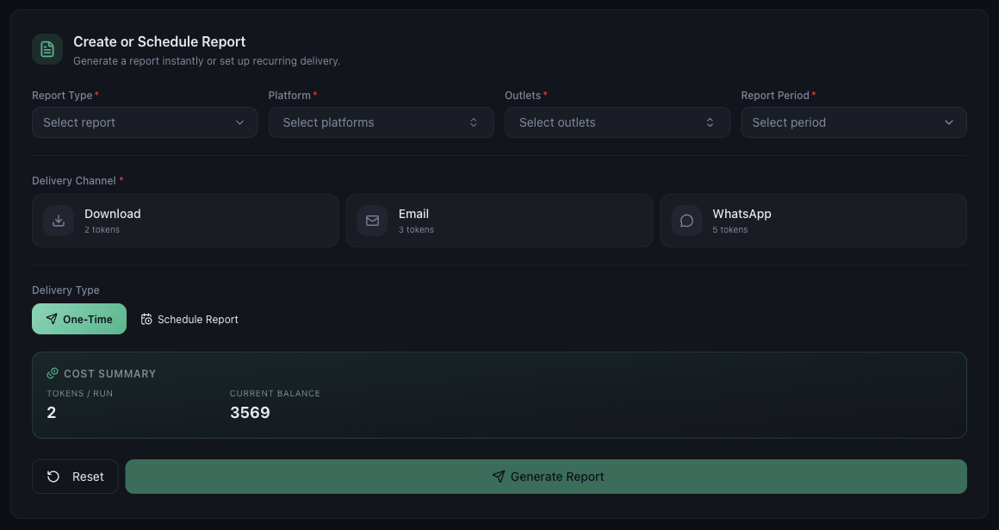

# What Reports Are Available in Mynt

*Reports · Read time: 3 minutes · Article only · Last updated 25 August 2026*

One builder covers every report. You choose what it contains, which outlets and period it covers, and how it reaches you.

---

## The report builder

*Four choices define the report; two more define how it is delivered*

| | |
|---|---|
| **Report Type** | What the report contains. |
| **Platform** | Zomato, Swiggy, Toing, or all of them. |
| **Outlets** | Which locations to include. |
| **Report Period** | The date range the report covers. |
| **Delivery Channel** | Download, email or WhatsApp. |
| **Delivery Type** | One-time, or a recurring schedule. |

The page also offers raw platform data, so you can take the underlying figures into your own spreadsheet rather than only the summarised view.

## Reports cost tokens

Each run spends tokens, and the amount depends on the delivery channel. The cost is shown before you generate anything &mdash; see [generating a report](02-how-to-generate-and-download-report.md) and [what consumes tokens](../tokens/02-which-mynt-features-consume-tokens.md).

## One-time or recurring

- **One-Time** &mdash; generate it now.
- **Schedule Report** &mdash; have it delivered on a recurring basis. See [scheduling reports](03-schedule-automatic-reports.md).

## Related guides

- [Generating and downloading a report](02-how-to-generate-and-download-report.md)
- [Scheduling automatic reports](03-schedule-automatic-reports.md)
- [Managing your schedules](04-how-to-manage-report-schedules.md)

---

## Need help?

| Contact | Details |
|---------|---------|
| **Email** | contact@pyvot.in |
| **Phone** | +91 98366 66745 |
| **Phone** | +91 82407 91854 |

Or open **Help & Support** in Mynt and raise a ticket.
