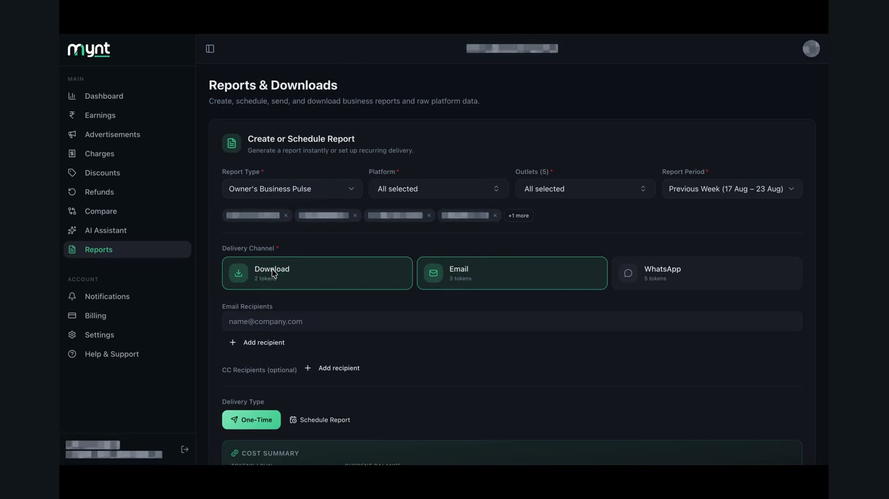
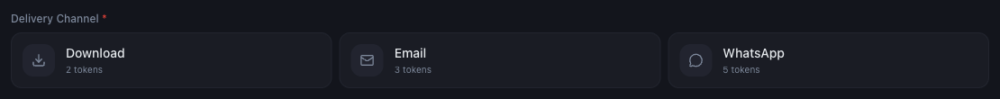
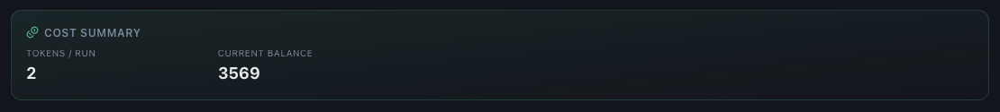

# How to Generate and Download a Report

*Reports · Read time: 3 minutes · Includes a short video · Last updated 25 August 2026*

Fill in four fields, check the token cost, and generate. The cost is always shown before you commit.

---

## Watch it done

**Video:** [Filling in the builder and watching the token cost change with the delivery channel](assets/how-to-generate-and-download-report/demo.mp4)

## Step 1 — define the report

1. Choose a **Report Type**.
2. Choose the **Platform** &mdash; one, or all.
3. Choose the **Outlets** to include.
4. Choose the **Report Period**.

## Step 2 — choose how it reaches you

*Each channel has its own token cost, shown on the option itself*

| | |
|---|---|
| **Download** | Cheapest &mdash; the file comes straight back to you. |
| **Email** | Delivered to your registered address. |
| **WhatsApp** | Delivered to your registered number, and the most expensive of the three. |

## Step 3 — check the cost

*Tokens per run against your current balance &mdash; visible before you generate*

If the balance is too low, top up first &mdash; see [checking your balance and getting more](../tokens/03-how-to-check-token-usage-balance-get-more.md).

## Step 4 — generate

Press **Generate Report**. With **Download** selected the file comes back to you; with email or WhatsApp it is sent to your registered address or number. **Reset** clears the form and starts again.

> **Tip:** Generate one small report first to confirm the type and period are what you expect. Tokens are spent per run, so a wrong setting costs a second run.

## If a report does not arrive

1. Check **Help & Support → System Status** &mdash; **Report Generation** is listed there.
2. For email delivery, check the spam folder of your registered address.
3. Confirm the token balance was sufficient at the time.
4. Still missing? [Raise a ticket](../data-issues/06-how-to-raise-data-issue-support-ticket.md) with issue type **Report**.

## Related guides

- [What reports are available](01-what-reports-are-available.md)
- [Scheduling automatic reports](03-schedule-automatic-reports.md)
- [What consumes tokens](../tokens/02-which-mynt-features-consume-tokens.md)

---

## Need help?

| Contact | Details |
|---------|---------|
| **Email** | contact@pyvot.in |
| **Phone** | +91 98366 66745 |
| **Phone** | +91 82407 91854 |

Or open **Help & Support** in Mynt and raise a ticket.
