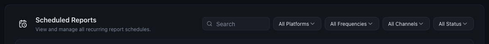

# How to Manage Your Report Schedules

*Reports · Read time: 3 minutes · Article only · Last updated 25 August 2026*

Every recurring report you have set up is listed in one place, with filters for finding the one you want.

---

## Where they live

Open **Reports** and scroll to **Scheduled Reports**.

*All recurring schedules, with filters for platform, frequency, channel and status*

| | |
|---|---|
| **All Platforms** | Narrow to schedules for one platform. |
| **All Frequencies** | Daily, weekly or monthly. |
| **All Channels** | Download, email or WhatsApp. |
| **All Status** | Active or paused. |

With no schedules yet, the section reads **No scheduled reports yet** and offers to create one &mdash; see [scheduling automatic reports](03-schedule-automatic-reports.md).

## Keeping the list under control

1. Review the list when your token balance drops faster than expected &mdash; every schedule spends tokens per run.
2. Filter by **All Channels** to find WhatsApp schedules, the most expensive per run.
3. Pause or remove anything nobody reads.
4. Check frequency matches the payout cycle &mdash; a daily report of weekly-settled data mostly repeats itself.

> **Tip:** A forgotten daily schedule is the most common reason a token balance falls without anyone using the AI Assistant.

## If a scheduled report stops arriving

1. Check the schedule is still active in this list.
2. Check your token balance &mdash; a run with insufficient tokens cannot complete.
3. Check **Help & Support → System Status** for **Report Generation**.
4. [Raise a ticket](../data-issues/06-how-to-raise-data-issue-support-ticket.md) with issue type **Report**.

## Related guides

- [Scheduling automatic reports](03-schedule-automatic-reports.md)
- [Checking your token balance](../tokens/03-how-to-check-token-usage-balance-get-more.md)
- [Generating a report](02-how-to-generate-and-download-report.md)

---

## Need help?

| Contact | Details |
|---------|---------|
| **Email** | contact@pyvot.in |
| **Phone** | +91 98366 66745 |
| **Phone** | +91 82407 91854 |

Or open **Help & Support** in Mynt and raise a ticket.
