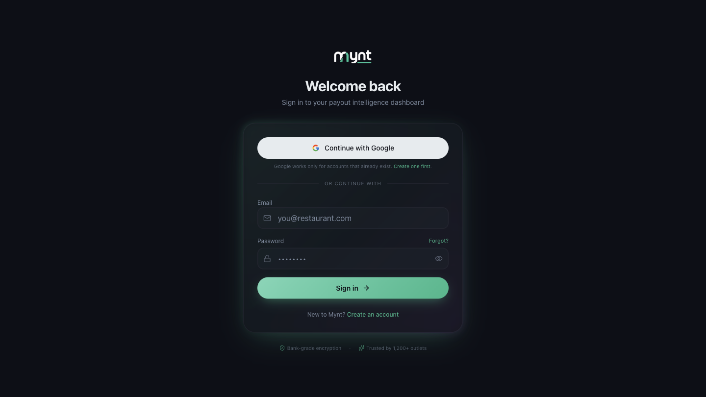
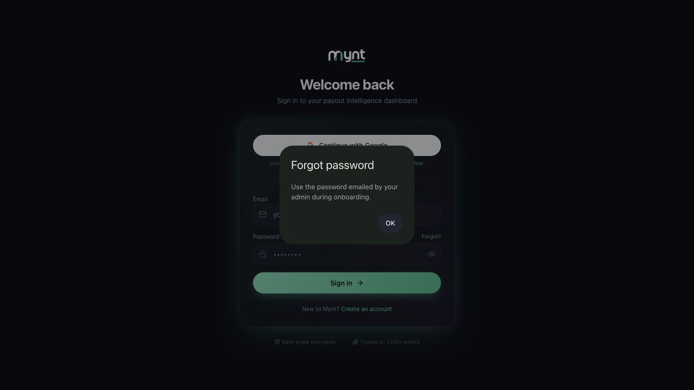

# How Sign-In and Account Access Work in Mynt

*Security · Read time: 4 minutes · Article only · Last updated 25 August 2026*

---

## Hello!

**Hello!** Mynt signs you in with an email and password, or with Google. Your session stays open on that browser until you sign out or it expires.

---

## How to sign in

1. Go to your Mynt login page.
2. Enter your **Email** and **Password**, then tap **Sign in**.
3. Mynt opens your dashboard.

You can also tap **Continue with Google**. That works only if a Mynt account already exists for that Google address — it signs you in, it does not create an account.

New user? See [How to create your Mynt account and sign in](../getting-started/02-how-to-create-your-mynt-account-and-sign-in.md).

---

## What happens after sign-in

| Piece | What it means |
|-------|---------------|
| **Session** | You stay signed in on that browser until you sign out or the session expires |
| **Your business** | The top of every page shows your business name, so you always know which account you are looking at |
| **Dashboard access** | Only people invited to your Mynt account can see your business data |

Mynt never asks for your Zomato or Swiggy passwords — only your Mynt login and, separately, permission to read your payout emails.

---

## Forgot your password?

Tap **Forgot?** next to the Password box on the login screen. Mynt tells you to use the password that was emailed to you by your admin when your account was set up.

There is no self-service reset link today. If you cannot find that email, contact support and they will verify you own the account before helping.

Once you are signed in, you can change your password yourself at **Settings → Security → Change Password**. You need your current password to set a new one.

---

## Making your sign-in stronger

Under **Settings → Security → Authentication** you can add a second step to your sign-in. All three are optional and you set them up yourself:

| Option | What it does |
|--------|--------------|
| **Authenticator app** | Six-digit codes from an app like Google Authenticator |
| **Passkey** | Sign in with Face ID, Touch ID or a security key — no password at all |
| **Recovery codes** | One-time codes to use if you lose your phone or security key |

Adding or removing any of these asks you to confirm your password first. See [How Mynt protects your business data](03-how-mynt-protects-business-data.md).

---

## Signing in on a new device

- Use the same email and password (or the same Google account) as before.
- If you have set up an authenticator app or passkey, you will be asked for it here.
- On a shared computer, always **sign out** when you finish. See [How to disconnect, sign out, and remove access](04-how-to-disconnect-sign-out-remove-access.md).

---

## Related guides

- [Creating your account](../getting-started/02-how-to-create-your-mynt-account-and-sign-in.md)
- [Understanding Google and Gmail permissions](02-understanding-google-gmail-permissions.md)
- [How Mynt protects your business data](03-how-mynt-protects-business-data.md)
- [Sign out and remove access](04-how-to-disconnect-sign-out-remove-access.md)

---

## Common questions

**Can my team share one login?** — Each person should have their own account. Sharing one password means you cannot tell who changed what, and signing out one person signs out everybody.

**Google sign-in or email and password?** — Both open the same Mynt account, as long as the Google address matches the email your account was created with.

**I signed in but the business name at the top looks wrong** — Contact support. A Mynt login opens one business account; there is no account switcher on the customer dashboard.

---

## Need help?

| Contact | Details |
|---------|---------|
| **Email** | contact@pyvot.in |
| **Phone** | +91 98366 66745 |
| **Phone** | +91 82407 91854 |

Or open **Help & Support** in Mynt and raise a ticket.
