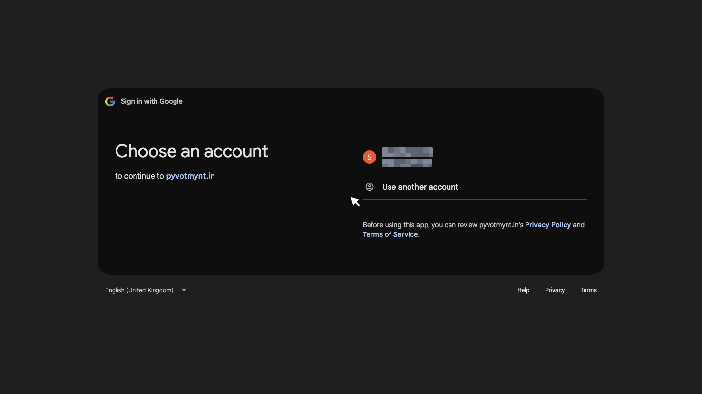
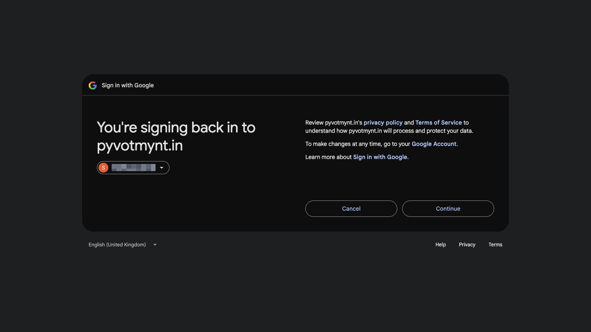

# Understanding Google and Gmail Permissions

*Security · Read time: 3 minutes · Article only · Last updated 25 August 2026*

---

## Hello!

**Hello!** Connecting Gmail is separate from signing in to Mynt. Google shows its own screen when you connect, and what it grants Mynt is read-only access to your inbox.

> For the full email-integration walkthrough, see **[What Gmail permissions does Mynt require?](../email-integration/02-gmail-permissions.md)**.

---

## Two different logins

| Login | Purpose |
|-------|---------|
| **Mynt sign-in** (email + password) | Opens your Mynt dashboard — sales, reports, settings |
| **Google permission** | Lets Mynt **read your payout emails** to build your dashboards |

You can be signed in to Mynt without Gmail connected, and connecting Gmail does not change your Mynt password.

See [How sign-in works](01-how-sign-in-account-access-work.md).

---

## What Google asks you

When you connect or reconnect a mailbox, Mynt sends you to Google. Google — not Mynt — asks which account you want to use.

Then Google asks you to confirm. If you have connected this mailbox before, Google shows a short "signing back in" screen with a **Continue** button. The first time you connect, Google instead lists each permission Mynt is asking for before you approve.

Nothing is shared with Mynt until you tap **Continue** (or **Allow** on the first-time screen). Tapping **Cancel** leaves your mailbox untouched.

---

## What Mynt asks for

Mynt requests exactly three things from Google:

| Permission | Why |
|------------|-----|
| **Your email address** | To know which mailbox is connected |
| **Basic sign-in identity** | To match the mailbox to your Mynt account |
| **Read-only access to Gmail** | To find and read payout emails from Zomato, Swiggy and other platforms |

The Gmail permission is **read-only**. That is a restriction Google enforces, not just a promise from us.

---

## What Mynt cannot do

| Action | |
|--------|---|
| Send email from your Gmail | Never — read-only access does not allow it |
| Delete or change your email | Never — same reason |
| See your Google password | Never — Google handles sign-in, Mynt never sees it |
| Read unrelated personal mail | Mynt looks for payout and settlement messages from delivery platforms |

---

## Changing or removing Gmail access later

| Goal | What to do |
|------|------------|
| **Use a different mailbox** | Settings → Email Integration → **Reconnect** on that row, then pick the other Google account |
| **Add another mailbox** | Settings → Email Integration → **Add SOA Email** |
| **Fully revoke Mynt from Google** | [Google Account → Third-party access](https://myaccount.google.com/permissions), then contact support so Mynt's side is cleaned up too |
| **Sign out of Mynt only** | See [Disconnect, sign out, remove access](04-how-to-disconnect-sign-out-remove-access.md) |

Mynt has no self-service **Disconnect** button today. Full removal steps: [How to disconnect or change Gmail](../email-integration/08-how-to-disconnect-or-change-gmail-account.md).

---

## Related guides

- [Gmail permissions (Email Integration)](../email-integration/02-gmail-permissions.md)
- [How sign-in and account access work](01-how-sign-in-account-access-work.md)
- [How Mynt protects your business data](03-how-mynt-protects-business-data.md)
- [Sign out and remove access](04-how-to-disconnect-sign-out-remove-access.md)

---

## Need help?

| Contact | Details |
|---------|---------|
| **Email** | contact@pyvot.in |
| **Phone** | +91 98366 66745 |
| **Phone** | +91 82407 91854 |

Or open **Help & Support** in Mynt and raise a ticket.
