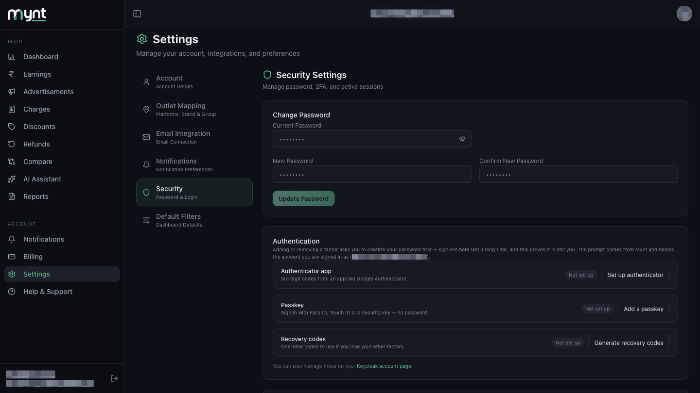
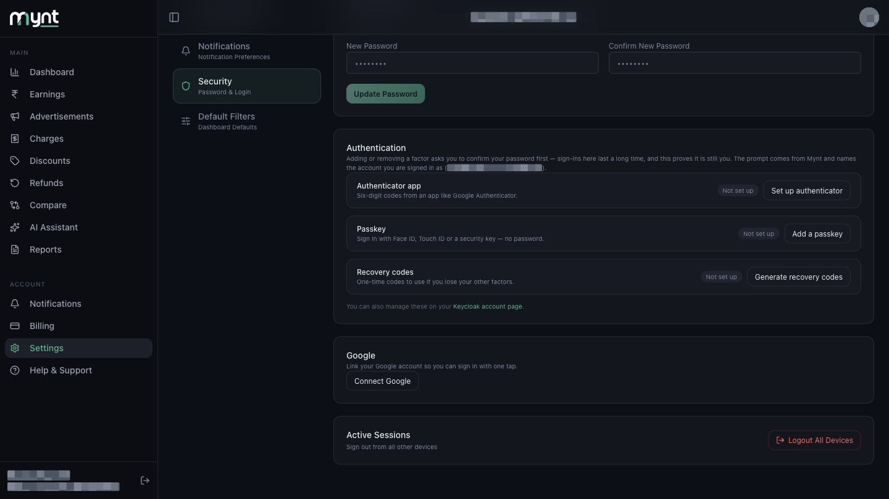

# How Mynt Protects Your Business Data

*Security · Read time: 4 minutes · Article only · Last updated 25 August 2026*

---

## Hello!

**Hello!** Your payout data is sensitive: sales, commissions, bank settlements. Passwords are hashed, traffic runs over HTTPS, card details are handled by a PCI-compliant payment company rather than stored by Mynt, and Gmail access is read-only.

---

## A few words explained first

| Word | What it means |
|------|---------------|
| **Two-factor authentication (2FA)** | A second check after your password — a code from an app, or your fingerprint or face. Even someone who steals your password cannot get in without it. |
| **HTTPS** | The padlock in your browser's address bar. It scrambles everything travelling between your device and Mynt so nobody in between can read it. |
| **PCI-compliant** | A card-industry safety standard. It means card details are handled by a specialist payment company that is audited for it — Mynt never stores your full card number. |

---

## What we protect

- **Dashboard numbers** — sales, orders, payouts, marketing spend
- **Outlet and mapping details** — your restaurant locations and platform IDs
- **Connected mailboxes** — which inbox receives your payout mail
- **Account credentials** — your Mynt login

---

## How Mynt keeps data safe

### Secure sign-in

Passwords are **hashed** — stored scrambled, so Mynt staff cannot read yours. Sessions use tokens that expire.

You can also add a second step yourself at **Settings → Security → Authentication**: an authenticator app, a passkey (Face ID, Touch ID or a security key), or one-time recovery codes. Adding or removing any of them asks you to confirm your password first.

See [How sign-in works](01-how-sign-in-account-access-work.md).

### Read-only access to your email

Mynt only **reads** payout emails — it cannot send, delete or change anything, because Google only ever grants read-only permission. You can revoke it at any time from your Google Account.

See [Understanding Google and Gmail permissions](02-understanding-google-gmail-permissions.md).

### Encrypted connections

All traffic between your browser and Mynt uses **HTTPS**, so it is scrambled in transit. Stored data sits in secured cloud infrastructure with restricted access.

### Account isolation

Each business's data is kept separate. People see only the account they were invited to. Support staff access is limited to resolving tickets you raise.

### Payment security

Card payments go through a **PCI-compliant** payment partner. Mynt does not store your full card number. See [How payments, GST and billing details work](../billing/06-how-payments-gst-billing-details-work.md).

### You can end every session yourself

**Settings → Security → Active Sessions → Logout All Devices** signs out every browser and phone using your account, including the one you are on.

---

## Your responsibilities

| Do | Don't |
|----|-------|
| Use a strong, unique Mynt password | Share one login across the whole team |
| Turn on an authenticator app or passkey | Rely on the password alone on a shared machine |
| Sign out on shared computers | Leave sessions open on public PCs |
| Connect the **correct payout mailbox** | Connect a personal inbox with no business mail |
| Review Google third-party access from time to time | Ignore a mailbox that has stopped syncing |

---

## If you suspect a problem

1. **Change your password** — Settings → Security → Change Password
2. **Sign out everywhere** — Settings → Security → Logout All Devices
3. **Revoke Gmail access** — [Google Account permissions](https://myaccount.google.com/permissions)
4. **Contact support** — contact@pyvot.in, or raise a ticket in Help & Support

See [How to disconnect, sign out, and remove access](04-how-to-disconnect-sign-out-remove-access.md).

---

## Related guides

- [Sign-in and account access](01-how-sign-in-account-access-work.md)
- [Google and Gmail permissions](02-understanding-google-gmail-permissions.md)
- [Sign out and remove access](04-how-to-disconnect-sign-out-remove-access.md)
- [How to disconnect or change Gmail](../email-integration/08-how-to-disconnect-or-change-gmail-account.md)

---

## Need help?

| Contact | Details |
|---------|---------|
| **Email** | contact@pyvot.in |
| **Phone** | +91 98366 66745 |
| **Phone** | +91 82407 91854 |

Or open **Help & Support** in Mynt and raise a ticket.
