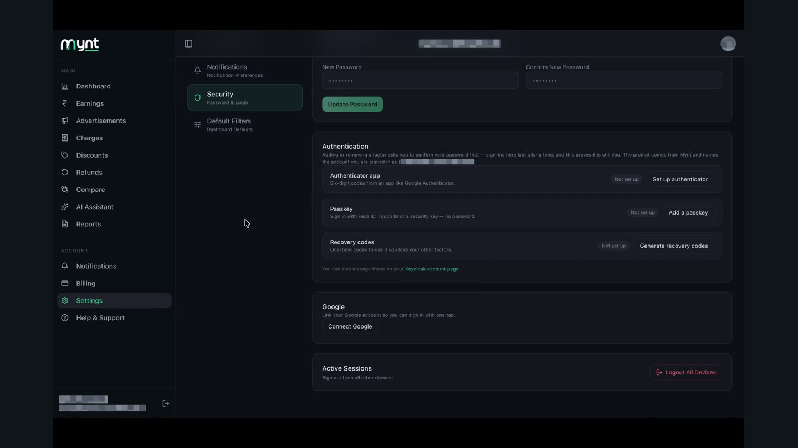
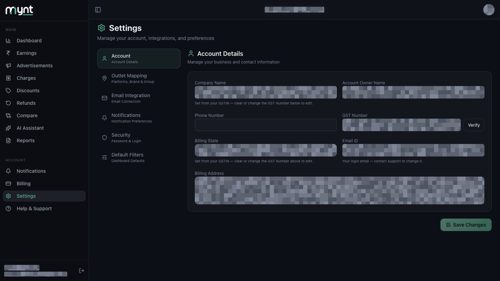
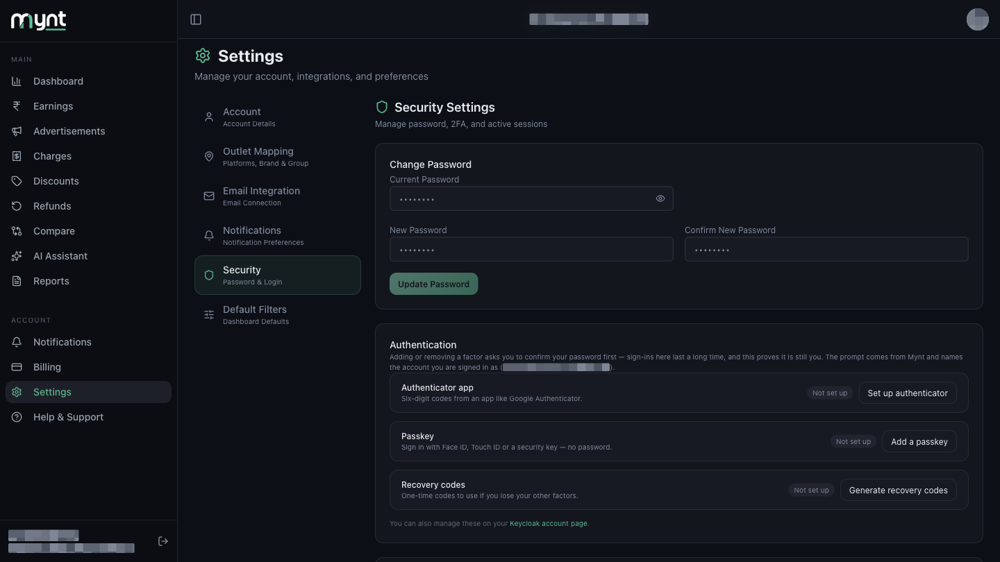
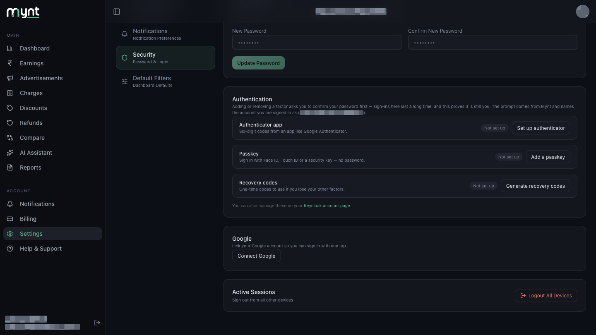
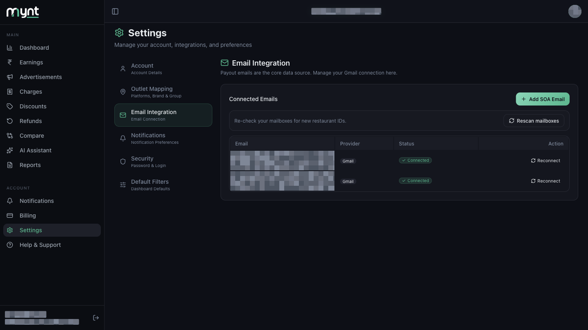

# How to Disconnect Integrations, Sign Out or Remove Account Access

*Security · Read time: 4 minutes · Includes a short video · Last updated 25 August 2026*

---

## Hello!

**Hello!** Signing out of Mynt, ending every session on every device, and changing which Gmail is connected are three different actions with three different effects.

---

## Watch this first

**[▶ Watch demo video](assets/disconnect-sign-out-remove-access/demo.mp4)**

*Where to find Reconnect and Logout All Devices inside Settings.*

---

## Three different actions

| What you want | Where to go |
|---------------|-------------|
| **Sign out of Mynt** (this device only) | Sidebar → **Sign out** |
| **Sign out everywhere** | Settings → **Security** → Active Sessions → **Logout All Devices** |
| **Change which Gmail is connected** | Settings → **Email Integration** → **Reconnect** |

These are separate. Signing out of Mynt does **not** revoke Gmail access, and changing your Gmail does **not** sign you out.

---

## Sign out of Mynt on this device

1. Look at the bottom of the left sidebar, where your name and email are shown.
2. Tap the **Sign out** icon next to them.
3. You return to the login screen. Your Gmail connection stays active for next time.

---

## Sign out of all devices

Use this if you lost a laptop or phone, or think someone else has your session.

### Step 1 — Open Settings

In the left menu, tap **Settings**.

---

### Step 2 — Open Security

In the settings menu, tap **Security**.

---

### Step 3 — Logout All Devices

Scroll down to **Active Sessions** and tap **Logout All Devices**.

> **This signs out every browser and phone using your Mynt account — including the one you are on right now.** You will be returned to the login screen and will need to sign in again.

---

## Change your password while you are here

The same **Security** page has **Change Password** at the top. You need your current password to set a new one. Below it, **Authentication** lets you add an authenticator app, a passkey, or recovery codes.

See [How sign-in and account access work](01-how-sign-in-account-access-work.md).

---

## Gmail: change or remove access

Mynt does **not** have a self-serve **Disconnect** button today.

| Goal | Action |
|------|--------|
| **Use a different payout mailbox** | Settings → Email Integration → **Reconnect** on that row → pick the other Google account → confirm |
| **Add another mailbox** | Settings → Email Integration → **Add SOA Email** |
| **Re-check a mailbox for new restaurant IDs** | Settings → Email Integration → **Rescan mailboxes** |
| **Fully remove Gmail from Mynt** | Contact support **and** revoke Mynt in [Google Account permissions](https://myaccount.google.com/permissions) |

Each connected mailbox has its own **Reconnect** button. A mailbox still waiting for permission shows **Authorize** instead.

> **Note:** Reconnecting replaces the Google authorisation for that mailbox. Dashboard data already collected from it stays unless support removes it.

Full guide: [How to disconnect or change Gmail](../email-integration/08-how-to-disconnect-or-change-gmail-account.md).

---

## Related guides

- [Sign-in and account access](01-how-sign-in-account-access-work.md)
- [Google and Gmail permissions](02-understanding-google-gmail-permissions.md)
- [How Mynt protects your business data](03-how-mynt-protects-business-data.md)
- [How to disconnect or change Gmail](../email-integration/08-how-to-disconnect-or-change-gmail-account.md)
- [How to reconnect Gmail when the connection expires](../email-integration/06-how-to-reconnect-gmail-when-connection-expires.md)

---

## Need help?

| Contact | Details |
|---------|---------|
| **Email** | contact@pyvot.in |
| **Phone** | +91 98366 66745 |
| **Phone** | +91 82407 91854 |

Or open **Help & Support** in Mynt and raise a ticket.
