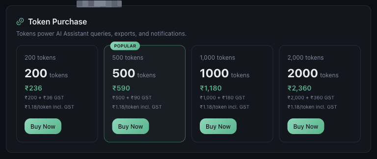

# What Are Mynt Tokens?

*Tokens · Read time: 3 minutes · Article only · Last updated 25 August 2026*

Tokens are Mynt&rsquo;s pay-as-you-go currency for the features that cost something to run. They are separate from your outlet licences.

---

## What they are for

*Tokens power AI Assistant queries, exports and notifications*

## Tokens and licences are different things

| | |
|---|---|
| **Outlet licence** | Annual, per outlet. Activates data collection for that location. |
| **Tokens** | Pay as you go. Spent by AI Assistant queries, report runs and notifications. |

Running out of tokens does not switch off your dashboards, and buying tokens does not add an outlet. See [pricing and annual licences](../billing/01-understanding-mynt-pricing-annual-outlet-licences.md).

## How they are bought

Tokens come in packs, bought from **Billing**. Larger packs cost less per token, and GST is itemised on each pack before you buy. See [checking your balance and getting more](03-how-to-check-token-usage-balance-get-more.md).

## Do they expire?

Tokens sit on your account as a balance and are spent as you use the features that consume them. Your balance is shown on the Billing page.

## Related guides

- [What consumes tokens](02-which-mynt-features-consume-tokens.md)
- [Checking your balance and getting more](03-how-to-check-token-usage-balance-get-more.md)
- [Payments, GST and billing details](../billing/06-how-payments-gst-billing-details-work.md)

---

## Need help?

| Contact | Details |
|---------|---------|
| **Email** | contact@pyvot.in |
| **Phone** | +91 98366 66745 |
| **Phone** | +91 82407 91854 |

Or open **Help & Support** in Mynt and raise a ticket.
