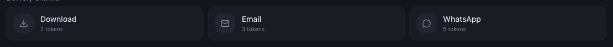

# Which Mynt Features Consume Tokens?

*Tokens · Read time: 3 minutes · Article only · Last updated 25 August 2026*

Three things spend tokens: AI Assistant queries, report runs and notifications. Reports are usually the largest by far.

---

## Reports — the cost is per run, per channel

*The cost is on the option itself &mdash; WhatsApp costs the most per run*

| | |
|---|---|
| **Download** | The cheapest channel. |
| **Email** | Slightly more than download. |
| **WhatsApp** | The most expensive of the three. |

A *scheduled* report spends that cost every time it runs. A daily WhatsApp schedule is the single fastest way to spend a balance &mdash; see [scheduling automatic reports](../reports/03-schedule-automatic-reports.md).

## AI Assistant

Each question you ask the assistant spends tokens, because each one runs a real query over your data.

## Notifications

Delivered alerts also consume tokens.

## What does not cost tokens

- Viewing dashboards and metric pages.
- Changing filters.
- Outlet mapping, brand and group changes.
- Reading invoices and licence information.

> **Tip:** If your balance falls without anyone using the assistant, look for a forgotten report schedule before anything else &mdash; see [managing schedules](../reports/04-how-to-manage-report-schedules.md).

## Related guides

- [Checking your balance and getting more](03-how-to-check-token-usage-balance-get-more.md)
- [Generating a report](../reports/02-how-to-generate-and-download-report.md)
- [What Mynt tokens are](01-what-are-mynt-tokens.md)

---

## Need help?

| Contact | Details |
|---------|---------|
| **Email** | contact@pyvot.in |
| **Phone** | +91 98366 66745 |
| **Phone** | +91 82407 91854 |

Or open **Help & Support** in Mynt and raise a ticket.
