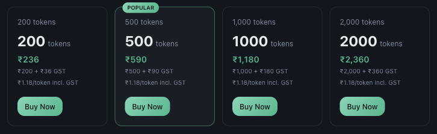

# How to Check Your Token Balance and Get More

*Tokens · Read time: 3 minutes · Article only · Last updated 25 August 2026*

Your balance is on the Billing page, and so are the packs. Both are two clicks from anywhere in Mynt.

---

## Checking the balance

Open **Billing**. The balance sits in the summary at the top of the page.

*Your current balance, alongside your licence summary*

The report builder shows it too, next to the cost of the run you are about to make &mdash; see [generating a report](../reports/02-how-to-generate-and-download-report.md).

## Buying more

*Four packs &mdash; the larger the pack, the lower the cost per token*

1. Open **Billing** and find **Token Purchase**.
2. Compare the packs. Each shows the base price, the GST added and the effective cost per token including GST.
3. Press **Buy Now** on the pack you want.
4. Pay by UPI, credit card, net banking or auto debit.

The purchase appears in **Invoices & Payment History** with its own invoice &mdash; see [viewing and downloading invoices](../billing/05-how-to-view-download-invoices.md).

## Choosing a pack

| | |
|---|---|
| **Occasional use** | The smallest pack is enough for ad-hoc assistant questions and the odd report. |
| **Regular reporting** | A mid pack. Work out your monthly burn from your schedules first. |
| **Daily schedules** | The largest pack &mdash; the per-token cost is lowest and daily runs add up quickly. |

> **Tip:** Before topping up, check [your report schedules](../reports/04-how-to-manage-report-schedules.md). Turning off one unread daily report often saves more than the next pack up.

## Related guides

- [What consumes tokens](02-which-mynt-features-consume-tokens.md)
- [Payments, GST and billing details](../billing/06-how-payments-gst-billing-details-work.md)
- [Managing report schedules](../reports/04-how-to-manage-report-schedules.md)

---

## Need help?

| Contact | Details |
|---------|---------|
| **Email** | contact@pyvot.in |
| **Phone** | +91 98366 66745 |
| **Phone** | +91 82407 91854 |

Or open **Help & Support** in Mynt and raise a ticket.
